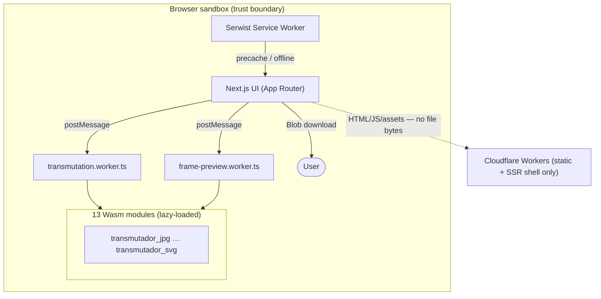
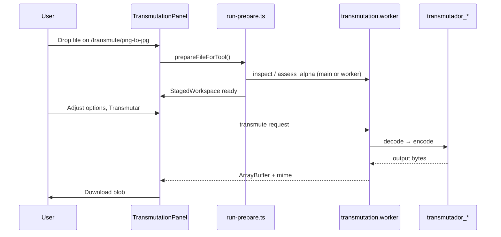

# Camaleon — Architecture Atlas

> **Purpose:** Single-source architectural context for humans and AI agents starting a fresh session.  
> **Audience:** Maintainers, contributors, and coding assistants.  
> **Companion docs:** [SPEC](docs/SPEC.md) (normative requirements) · [ROADMAP](docs/ROADMAP.md) (delivery phases) · [README](README.md) (quick start)

**Snapshot:** App **v3.7.1** · Engine **v1.7.0** · Branch **`dev`** · **25 active tools** · **13 Wasm crates** · **183 Vitest tests**

---

## Table of contents

1. [North star](#1-north-star)
2. [System context](#2-system-context)
3. [Repository map](#3-repository-map)
4. [Version & product tiers](#4-version--product-tiers)
5. [Runtime architecture](#5-runtime-architecture)
6. [Frontend architecture](#6-frontend-architecture)
7. [Conversion flows](#7-conversion-flows)
8. [Tool registry (25 tools)](#8-tool-registry-25-tools)
9. [Rust / Wasm engine](#9-rust--wasm-engine)
10. [Worker protocol](#10-worker-protocol)
11. [Prepare pipeline](#11-prepare-pipeline)
12. [Limit & safety pipeline](#12-limit--safety-pipeline)
13. [Semantic Alpha Engine](#13-semantic-alpha-engine)
14. [Notice Rail](#14-notice-rail)
15. [Batch system (Tier 3.6)](#15-batch-system-tier-36)
16. [Universal transmutator (Tier 3.5)](#16-universal-transmutator-tier-35)
17. [Settings & preferences](#17-settings--preferences)
18. [PWA & offline shell](#18-pwa--offline-shell)
19. [App updates](#19-app-updates)
20. [Toast & floating notices](#20-toast--floating-notices)
21. [Internationalization](#21-internationalization)
22. [Release comms & What's New](#22-release-comms--whats-new)
23. [Testing strategy](#23-testing-strategy)
24. [CI, deploy & branches](#24-ci-deploy--branches)
25. [Adding a new tool (checklist)](#25-adding-a-new-tool-checklist)
26. [Document index](#26-document-index)

---

## 1. North star

Camaleon is a **browser-local, privacy-first image transmutation platform**. All decode/encode logic runs on the user's device via **Rust compiled to WebAssembly**, orchestrated from a **Next.js** UI through **Web Workers**. File bytes **never leave the browser** in the conversion path.

### Architectural principles

| # | Principle | Implication |
|---|-----------|-------------|
| P1 | Privacy by design | No server-side conversion; no analytics on file content |
| P2 | Modular transmutators | One Rust crate per conversion direction; crates do not depend on each other |
| P3 | Worker isolation | All Wasm on Web Workers; UI thread stays responsive |
| P4 | Explicit contracts | Wasm public APIs are typed, documented, versioned |
| P5 | Fail loudly | Structured errors; UI never silently drops failures |
| P6 | SPEC sync | Behavioral changes update `docs/SPEC.md` |
| P7 | Metadata strip by default | Output strips EXIF/XMP/text unless future opt-in (StripAll doctrine) |

### Product scope ladder

| Ladder | Domain | Status |
|--------|--------|--------|
| **A** | Image transmutation (format → format) | ✅ Tiers 1–2 + Semantic Alpha |
| **B** | Modern formats (AVIF, SVG→raster) + PWA | ✅ Tier 3 complete (v3.0.1) |
| **C** | Image optimization (compress, resize) | ✅ Tier 4a **functional (v3.3.0)** |
| **D** | Image editing (crop, rotate) | 📋 Tier 4b |
| **E** | Documents (PDF, etc.) | 🚫 Deferred |

---

## 2. System context



**Trust boundary:** Everything inside the browser. Cloudflare serves the app shell and static assets; **no file payload** crosses the network during transmutation.

---

## 3. Repository map

```
camaleon/
├── ARCHITECTURE.md          ← this document (atlas)
├── README.md                ← quick start & capability summary
├── frontend/                ← Next.js 15 app (v3.2.9)
│   ├── src/
│   │   ├── app/             ← App Router pages, layout, SW source
│   │   ├── components/      ← React UI (transmute, settings, layout, toast…)
│   │   ├── hooks/           ← useReleaseComms, useCommandPalette…
│   │   ├── lib/             ← Business logic (batch, tools, prefs, notices…)
│   │   ├── providers/       ← React context providers
│   │   └── workers/         ← Web Worker entry points
│   ├── public/wasm/         ← Generated Wasm artifacts (gitignored)
│   └── scripts/             ← build-wasm.mjs, verify scripts
├── motor_transmutacion/     ← Rust workspace (v1.6.0)
│   ├── core_utils/          ← Shared validation, semantic alpha, limits
│   └── transmutador_*/      ← 13 Wasm cdylib crates (incl. optimize)
├── docs/
│   ├── SPEC.md              ← Normative spec (authoritative for behavior)
│   ├── ROADMAP.md           ← Phased delivery
│   ├── LIMIT_PIPELINE.md    ← Limit/session regression reference
│   ├── DEPLOY.md            ← Cloudflare deploy
│   ├── releases/            ← Per-version release notes
│   └── planning/            ← Tier plans (3.5, 3.6, settings, PWA…)
├── scripts/                 ← build-wasm.sh / .ps1 (see §9 build note)
└── .github/workflows/ci.yml ← cargo test + build:wasm + next build
```

### Layer responsibilities

| Layer | Path | Responsibility |
|-------|------|----------------|
| Presentation | `frontend/src/app`, `components/` | Routes, dropzones, download, modals |
| Orchestration | `providers/`, `hooks/` | Worker lifecycle, global state |
| Domain logic | `frontend/src/lib/` | Prepare, limits, batch, tools, notices |
| Concurrency | `frontend/src/workers/` | Wasm load, message dispatch, result cache |
| Shared engine | `motor_transmutacion/core_utils/` | Errors, validation, semantic alpha |
| Transmutators | `motor_transmutacion/transmutador_*/` | Format-specific decode/encode |

**Rule:** Transmutator crates **must not** depend on each other. Shared code lives in `core_utils`.

---

## 4. Version & product tiers

App semver (`frontend/package.json`) and engine semver (`motor_transmutacion/Cargo.toml` workspace) **diverge by design** during parallel UI/engine tracks.

| Tier / phase | App versions | What shipped |
|--------------|--------------|--------------|
| MVP | v1.0.0 | JPEG ↔ PNG |
| Tier 1 WebP | v1.7.x | 6 tools (JPG/PNG ↔ WebP) |
| Tier 2 Wave 1 | v1.8–v1.9 | GIF, BMP, limits, astro downscale |
| Tier 2 Wave 2 | v1.10.x | TIFF, ICO↔PNG, TGA |
| Semantic Alpha | v1.11.0 | Honest transparency detection |
| Visual UX shell | v1.12.x | ToolBrowser, Command Palette, brand |
| Tier 3 (AVIF+SVG+PWA) | v2.x → v3.0.1 | 25 tools, offline shell, Settings S5 |
| Tier 3.5 Universal | v3.1.x | Home-page format picker + handoff |
| Tier 3.6.0 Batch | v3.2.0–v3.2.3 | Multi-file on 14 dedicated routes |
| Tier 3.6.1 Universal batch | v3.2.4–v3.2.9 | Homogeneous + mixed cohort picker (complete) |
| Tier 3.6.2 | v3.2.9 | ZIP pref; GIF/TIFF/ICO per-row batch |
| Tier 4a Optimize | v3.2.9 scaffold → **v3.3.0** | compress + resize (`transmutador_optimize`) **activated** |
| **Prior** | **v3.6.0** | Resize Premium — 5 filters, upscale, quality control, target dims, estimate parity |
| **Current** | **v3.7.1** | Compress Premium Phase B — JPEG encoder swap, subsampling control |
| **Prior** | **v3.7.0** | Compress Premium Phase A — honesty notices, color type fix, defaults alignment |
| **Next** | TBD | **Compress Phase B** — JPEG encoder swap · UX-4a ToolBrowser |

---

## 5. Runtime architecture

### Provider stack (`frontend/src/app/layout.tsx`)

Bootstrap scripts run **before React paint** (no FOUC):

- `PREFERENCES_BOOTSTRAP_SCRIPT` — theme, locale, overlay-scroll from cookies/localStorage
- `OFFLINE_BOOTSTRAP_SCRIPT` — early offline / force-offline state

**Provider nesting (outer → inner):**

| Order | Provider | Role |
|-------|----------|------|
| 1 | `I18nProvider` | Locale + `t()` |
| 2 | `ThemeProvider` | Light/dark |
| 3 | `OfflineProvider` | Connectivity, SW registration, force-offline |
| 4 | `AppUpdateProvider` | Version beacon + SW waiting detection |
| 5 | `TransmutationWorkerProvider` | Singleton transmutation worker; route lifecycle recycle |
| 6 | `ToastProvider` | Toast queue; promotes floating layer over modals |
| 7 | `ReleaseCommsProvider` | Onboarding, changelog modal, What's New drawer |
| 8 | `RiskModeProvider` | Advanced limit bypass (Settings S6) |
| 9 | `SettingsProvider` | Settings drawer open state |

**Portals / siblings:** `FloatingNoticesRoot`, `Header`, `Footer`, `OverlayScrollbar`, `AmbientBloom`.

### Routes

| Route | File | Purpose |
|-------|------|---------|
| `/` | `app/page.tsx` | Hero, Universal transmutator, ToolBrowser |
| `/transmute/[slug]` | `app/transmute/[slug]/page.tsx` | Per-tool workspace (SSG for all active slugs) |
| `/about`, `/privacy`, `/terms`, `/contact` | Legal pages | Bilingual legal content |
| `/~offline` | `app/~offline/page.tsx` | SW navigation fallback |
| `/version.json` | `app/version.json/route.ts` | App version beacon (no-store) |
| `/manifest.webmanifest` | `app/manifest.ts` | PWA manifest |

---

## 6. Frontend architecture

### Key UI components

| Area | Primary files | Role |
|------|---------------|------|
| Single-file workspace | `TransmutationPanel.tsx`, `StagedWorkspace.tsx` | Drop → prepare → options → transmute → download |
| Batch workspace | `BatchTransmutationPanel.tsx`, `lib/batch/BatchWorkspace.tsx` | Multi-file orchestration |
| Universal entry | `UniversalTransmutator.tsx`, `UniversalOutputPicker.tsx`, `UniversalCohortSummary.tsx` | Home-page multi/single drop |
| Settings | `SettingsDrawer.tsx` + `*SettingsSection.tsx` | S1–S7 preference sections |
| Discovery | `ToolBrowser.tsx`, Command Palette (`useCommandPalette`) | Tool discovery |
| Limits UX | `OversizeConsentPanel`, `HardFileBlockPanel`, `DimensionsBlockPanel`, `AstroResizePanel` | Byte/pixel gates |
| Format scrubbers | `GifFrameScrubber`, `AvifFrameScrubber`, `TiffPageScrubber`, `IcoEntryPicker` | Per-format index selection |
| Notices | `NoticeRail.tsx`, `NoticePanel.tsx` | Contextual operational warnings |

### Panel state machine (single-file)

```
idle → preparing → staged → processing → success | error
```

- **Preparing:** `FilePrepareGate` + `prepareFileForTool()` (see §11)
- **Staged:** `StagedWorkspace` — options, metrics, notices, transmute button
- **Crossfade:** 460 ms transition from prepare gate to staged workspace

### `lib/` subsystems

| Directory | Responsibility |
|-----------|----------------|
| `tools/` | Registry, universal matrix, cohorts, extensions, filter |
| `transmutation/` | Prepare, limits, handoff, download, fingerprint |
| `batch/` | Batch types, handoff, allowlist, prepare queue, limits |
| `universal/` | `resolveUniversalDrop()` classification |
| `notices/` | Staged notice computation pipeline |
| `semantic-alpha/` | Alpha assessment wrappers |
| `prefs/` | All user settings (localStorage) |
| `offline/` | SW, precache, connectivity, force-offline |
| `app-update/` | Version beacon, cache purge, hard reload |
| `toast/` | Queue constants, responsive max visible |
| `wasm/` | Crate URLs, glue loader, risk mode sync |
| `releases/` | Manifest, per-version entries, storage |
| `i18n/` | Dictionaries EN/ES, metadata, error localization |
| `format/`, `gif/`, `bmp/`, `tiff/`, `ico/`, `avif/`, `svg/`, `tga/` | Format-specific Wasm clients + meta inspect |
| `imaging/` | Client resize, astro downscale, frame preview |
| `device/` | Resource tier / performance profile / device capability detection |

---

## 7. Conversion flows

### 7.1 Direct tool route (single file)



### 7.2 Universal single-file handoff

1. User drops **one file** on home `UniversalTransmutator`.
2. `resolveUniversalDrop()` → `single`; `buildCohorts()` finds compatible tools.
3. User picks output (or auto if only one tool).
4. `stageFileHandoffFromFile()` → in-memory Map, **60 s TTL** (`lib/transmutation/file-handoff.ts`).
5. Navigate to `/transmute/{slug}?handoff={id}`.
6. `TransmutationPanel` consumes handoff on mount → prepare flow.

### 7.3 Universal homogeneous batch (Slice A+B)

1. User drops **N files of same format** (e.g. 5 JPG).
2. `resolveUniversalDrop()` → `batch`.
3. Filter outputs to batch-enabled tools via `batchOutputToolsForCohort()`.
4. `stageBatchHandoffFromFiles()` — reads all bytes pre-navigation (`lib/batch/batch-handoff.ts`).
5. Navigate to `/transmute/{slug}?batch={id}`.
6. `BatchTransmutationPanel` — shared options, row selection, sequential prepare → transmute → download.

### 7.4 Tool-route batch (Tier 3.6.0)

1. User drops **N files** directly on `/transmute/png-to-jpg` (drag from OS or file picker).
2. If `files.length >= 2` and slug is batch-enabled → batch workspace.
3. Incompatible extensions **skipped with notice** (not silently dropped).
4. Sequential processing; individual or ZIP download per S7 pref (v3.2.9+).

**Multi-file OS drag (v3.5.1):** `getDroppedFiles()` + dropzone `stopPropagation()`; `PageDropOverlay` does not intercept pointer events; `usePageFileDrop` defers to dropzone when target is `.transmute-dropzone`.

### 7.5 Mixed formats (current behavior)

Drop **different formats** in one gesture on Universal → **hint toast only**; no navigation. **Slice C** will add `UniversalCohortPicker` for mixed cohorts.

---

## 8. Tool registry (25 tools)

**Source of truth:** `frontend/src/lib/tools/tool-registry.ts`

All tools: `status: "active"`, `category: "image"`.

| # | Slug | Direction | Wasm module | Fidelity | Batch |
|---|------|-----------|-------------|----------|-------|
| 1 | `jpg-to-png` | JPG → PNG | `transmutador_jpg` | lossless | ✅ |
| 2 | `png-to-jpg` | PNG → JPG | `transmutador_png` | lossy | ✅ |
| 3 | `webp-to-png` | WebP → PNG | `transmutador_webp` | lossless | ✅ |
| 4 | `webp-to-jpg` | WebP → JPG | `transmutador_webp` | lossy | ✅ |
| 5 | `png-to-webp` | PNG → WebP | `transmutador_encode` | lossless | ✅ |
| 6 | `jpg-to-webp` | JPEG → WebP | `transmutador_encode` | lossless | ✅ |
| 7 | `gif-to-png` | GIF → PNG | `transmutador_gif` | lossless | ❌ |
| 8 | `gif-to-jpg` | GIF → JPG | `transmutador_gif` | lossy | ❌ |
| 9 | `bmp-to-png` | BMP → PNG | `transmutador_bmp` | lossless | ✅ |
| 10 | `bmp-to-jpg` | BMP → JPG | `transmutador_bmp` | lossy | ✅ |
| 11 | `tiff-to-png` | TIFF → PNG | `transmutador_tiff` | lossless | ❌ |
| 12 | `tiff-to-jpg` | TIFF → JPG | `transmutador_tiff` | lossy | ❌ |
| 13 | `ico-to-png` | ICO → PNG | `transmutador_ico` | lossless | ❌ |
| 14 | `png-to-ico` | PNG → ICO | `transmutador_ico` | lossless | ✅ |
| 15 | `avif-to-jpg` | AVIF → JPG | `transmutador_avif` | lossy | ✅ |
| 16 | `jpg-to-avif` | JPEG → AVIF | `transmutador_avif_encode` | lossy | ✅ |
| 17 | `png-to-avif` | PNG → AVIF | `transmutador_avif_encode` | lossy | ✅ |
| 18 | `avif-to-png` | AVIF → PNG | `transmutador_avif` | lossless | ✅ |
| 19 | `svg-to-png` | SVG → PNG | `transmutador_svg` | lossless | ❌ |
| 20 | `svg-to-jpg` | SVG → JPG | `transmutador_svg` | lossy | ❌ |
| 21 | `tga-to-png` | TGA → PNG | `transmutador_tga` | lossless | ✅ |

**Batch allowlist:** `frontend/src/lib/batch/batch-tool-allowlist.ts` — 14 slugs. GIF/TIFF/ICO/SVG excluded until per-row frame/page/entry UX exists (Tier 3.6.2+).

### Option types per tool

Defined in each tool's `optionSpecs` (`ToolOptionSpec`):

| Kind | Key | Used by |
|------|-----|---------|
| `slider` | `compression` | PNG output tools (1–9) |
| `slider` | `quality` | JPEG/AVIF lossy outputs (1–100) |
| `slider` | `speed` | AVIF encode (ravif speed) |
| `slider` | `outputScale` | SVG → raster scale presets |
| `slider` | `iconSize` | PNG → ICO target size |
| `color` | `background` | Lossy tools with alpha flatten |

Global defaults from Settings S2 (`transmutation-defaults.ts`) seed session options.

---

## 9. Rust / Wasm engine

**Workspace:** `motor_transmutacion/` · version **1.6.0** · edition 2021

### Crates

| Crate | Type | Direction |
|-------|------|-----------|
| `core_utils` | rlib (not Wasm) | Shared validation, semantic alpha, counting writer |
| `transmutador_jpg` | cdylib | JPEG → PNG |
| `transmutador_png` | cdylib | PNG → JPEG |
| `transmutador_webp` | cdylib | WebP → PNG, JPEG |
| `transmutador_encode` | cdylib | PNG, JPEG → WebP |
| `transmutador_gif` | cdylib | GIF → PNG, JPEG (+ frame session) |
| `transmutador_bmp` | cdylib | BMP → PNG, JPEG |
| `transmutador_tiff` | cdylib | TIFF → PNG, JPEG (+ multi-page) |
| `transmutador_ico` | cdylib | ICO/CUR → PNG; PNG → ICO |
| `transmutador_tga` | cdylib | TGA → PNG |
| `transmutador_avif` | cdylib | AVIF → PNG, JPEG (+ animated session) |
| `transmutador_avif_encode` | cdylib | PNG, JPEG → AVIF (split crate for size) |
| `transmutador_svg` | cdylib | SVG → PNG, JPEG (resvg/usvg) |
| `transmutador_optimize` | cdylib | PNG/JPEG compress + resize (Tier 4a) |

### Shared Wasm exports (every transmutador)

| Export | Purpose |
|--------|---------|
| `set_session_input_limit(max_bytes: u32)` | Raise byte ceiling for elevated/risk sessions |
| `reset_session_input_limit()` | Restore default (50 MB soft) |
| `set_risk_mode(enabled: bool)` | Bypass 40 MP cap; raise hard byte limits |

### `core_utils` highlights

| Module | Role |
|--------|------|
| `validate_input` / `validate_input_with_limit` | Empty, size, dimension guards |
| `probe_dimensions` | Magic-byte dimension probe (PNG/JPEG/BMP) |
| `semantic_alpha/` | Meaningful vs structural alpha assessment |
| `counting_writer` | Size estimation without allocating output |
| `flatten_rgba_on_background` | Alpha compositing for JPEG encode |
| Metadata scanners | EXIF/text chunk detection (StripAll policy) |

**Constants:** `MAX_INPUT_BYTES` 50 MB · `ABSOLUTE_MAX_INPUT_BYTES` 150 MB · `MAX_PIXELS` 40M · Risk desktop 500 MB / mobile 250 MB

### Build pipeline

**Canonical:** `frontend/scripts/build-wasm.mjs` via `npm run build:wasm`

- Output: `frontend/public/wasm/<crate>/`
- `wasm-pack build --target web` per crate
- `transmutador_svg`: `--no-default-features` (no system fonts on Wasm)
- RUSTFLAGS: `+simd128,+bulk-memory`

**Note:** `scripts/build-wasm.ps1` is **stale** (6 crates only). Use `build-wasm.mjs` or `build-wasm.sh` (11 crates; missing svg — prefer `.mjs`).

**Frontend registry:** `frontend/src/lib/wasm/wasm-crates.ts` must match build list.

---

## 10. Worker protocol

**Types:** `frontend/src/workers/types.ts`  
**Implementation:** `frontend/src/workers/transmutation.worker.ts`  
**Provider:** `frontend/src/providers/TransmutationWorkerProvider.tsx`

### Request (`WorkerRequest`)

| Field | Role |
|-------|------|
| `id` | Correlation ID |
| `module` | One of 12 `TransmutationModule` values |
| `bytes` | Input `ArrayBuffer` |
| `purpose` | `"transmute"` \| `"estimate"` \| `"purge"` |
| `outputExtension` | Disambiguates multi-output crates |
| `encodeSource` | `"png"` \| `"jpeg"` for encode crates |
| `options` | quality, compression, background, frameIndex, pageIndex, entryIndex, iconSize, speed, outputScale… |
| `effectiveMaxInputBytes` | Session byte ceiling |
| `riskModeEnabled` | Syncs Wasm risk mode |
| `alphaHint` | Skip redundant alpha scans on estimate (E0.5) |
| `fingerprint` / `fileIdentity` | Result + estimate cache keys |

### Response (`WorkerResponse`)

```typescript
// Success
{ id, ok: true, purpose, outputSize, bytes?, mime?, extension?, cacheHit? }
// Error
{ id, ok: false, error: string }  // includes "superseded" for cancelled estimates
```

### Execution model

- **Sequential pipeline:** requests queued (`pipeline = pipeline.then(...)`)
- **Lazy Wasm init** per module on first use
- **Estimate supersession:** new estimate cancels prior with `"superseded"`
- **Before work:** `set_risk_mode` → `set_session_input_limit`
- **After work (finally):** reset risk off + session limit to soft 50 MB
- **Worker recycle:** leaving any `/transmute/*` route terminates worker (memory lifecycle)
- **Second worker:** `frame-preview.worker.ts` for AVIF frame scrubbing only

### Estimation doctrine

Most crates use `CountingWriter` for byte-exact size without returning image bytes. Exceptions: `transmutador_encode` JPG→WebP and `transmutador_avif_encode` run full encode for estimate (expensive).

---

## 11. Prepare pipeline

**Entry:** `frontend/src/lib/transmutation/prepare/run-prepare.ts`

### Phases

```
reading → engine warmup → analyze → finalize
```

| Phase | Work |
|-------|------|
| **reading** | File → ArrayBuffer |
| **engine warmup** | Lazy Wasm module touch |
| **analyze** | Meta inspect (GIF/AVIF/TIFF/ICO/BMP/SVG), semantic alpha assess, dimension/limit context |
| **finalize** | Build `PreparedFile` for staged workspace |

### Format-specific analyze

| Format | Inspect / session |
|--------|-------------------|
| GIF | `inspect_gif_meta`, optional `GifSession` for scrubber |
| AVIF | `inspect_avif_meta`, `AvifSession` / frame-preview worker |
| TIFF | `inspect_tiff_meta`, page count |
| ICO | `inspect_ico_meta`, entry list |
| BMP | `inspect_bmp_meta` |
| SVG | `inspect_svg_meta`, output dimension computation |
| Raster | Dimension probe via `probe_dimensions` |

Prepare syncs **risk mode** and **session input limit** before any Wasm call.

---

## 12. Limit & safety pipeline

**Reference:** `docs/LIMIT_PIPELINE.md`

### Three independent limits

| Layer | Value | Enforced by |
|-------|-------|-------------|
| Bytes (soft) | 50 MB | Wasm default session |
| Bytes (hard) | 150 MB desktop / 100 MB mobile | `validate_input_with_limit` + UI block |
| Megapixels | 40 MP | `probe_dimensions` + `LimitContext` |

### Zone model

| Zone | Size | UI |
|------|------|-----|
| `normal` | ≤ 50 MB | No consent |
| `elevated` | 50 MB – hard | `OversizeConsentPanel` |
| `hard` | > hard limit | Block panel |

### Risk mode (Settings S6)

When enabled: bypass 40 MP, auto-consent elevated bytes, hard cap → 500/250 MB. **SVG external href security is never bypassed.**

**Unlock proceed (v3.3.1):** Gate-blocked files are retained in `hardLimitPendingFile`. Toggling Risk on shows `RiskUnlockProceedPanel` (Continue / Start over) instead of a dead-end error — single panel, Universal handoff, staged workspace, and batch (`risk-unlock.ts`, `BatchTransmutationPanel` re-prepare).

**Settings focus (v3.3.1):** `openSettings({ focus: "risk" | … })` scrolls the drawer and pulses the target section; `LimitUnlockHint` uses `focus: "risk"`.

**Offline promo (v3.3.2):** `OfflineInstallPromoNotice` on home (`bottom-left` desktop) — `openSettings({ focus: "offline" })`; 7-day snooze via `offline.installPromoSnoozedUntil`.

### Astro downscale

Images > 40 MP (or astronomical threshold) → client-side canvas downscale (`AstroResizePanel`) before Wasm. Presets 4K–12K.

### Frontend ↔ Wasm alignment

Always use `sessionLimitForBytes()` — never cap elevated files back to 50 MB in the worker. See `limit-context.ts`, `limits.ts`.

---

## 13. Semantic Alpha Engine

**Shipped:** v1.11.0 · **Goal:** Distinguish **meaningful** alpha (pixels with α < 255) from **structural** container flags.

| Layer | Path |
|-------|------|
| Rust core | `core_utils/src/semantic_alpha/` |
| Wasm assess | `assess_alpha`, `assess_page_alpha`, `assess_svg_meaningful_alpha` per crate |
| Frontend | `lib/semantic-alpha/assess.ts`, `needs-semantic-alpha.ts` |
| Prepare hook | Called during analyze when tool has `background` color option |
| Worker hint | `alphaHint` on estimate skips redundant raster scans |

**Contract tests:** `semantic_alpha_contract.rs` in png, webp, bmp, gif, tiff, avif crates — assess must agree with encode flatten behavior.

---

## 14. Notice Rail

**UI:** `NoticeRail.tsx` → filtered `NoticePanel` list

**Computation:** `lib/notices/compute-staged-notices.ts` merges:

| Source | Module |
|--------|--------|
| Limits | `compute-limit-notices.ts` |
| Fidelity / loss semantics | `compute-fidelity-notices.ts` |
| Performance / slow path | `compute-performance-notices.ts` |
| Estimate latency | `compute-estimate-notices.ts` |
| SVG honesty | `compute-svg-honesty-notices.ts` |

**Density:** Settings S4 (`notices-prefs.ts`) — `normal` vs `minimal` filter.

**Per-tool profiles:** `tool-notice-profiles.ts` — cost/latency hints per slug.

---

## 15. Batch system (Tier 3.6)

| File | Role |
|------|------|
| `batch-types.ts` | `BatchItem`, statuses, `batchItemsFromFiles()` |
| `batch-tool-allowlist.ts` | 14 batch-enabled slugs |
| `batch-handoff.ts` | Pre-navigation staging (500 MB desktop / 200 MB mobile caps) |
| `batch-limits.ts` | File count caps, aggregate byte warnings |
| `batch-prepare-queue.ts` | Sequential per-item prepare |
| `batch-option-scope.ts` | Global-only options in batch (no per-row sliders) |
| `BatchTransmutationPanel.tsx` | Orchestrator UI |
| `BatchWorkspace.tsx` | Row list, download tips, mode-aware hints (v3.5.1) |
| `lib/files/dropped-files.ts` | `getDroppedFiles()` — Explorer multi-select safe (v3.5.1) |
| `hooks/usePageFileDrop.ts` | Page-level drop; skips `.transmute-dropzone` (v3.5.1) |
| `hooks/useBatchDownloadMode.ts` | Reactive `batchDownloadMode` pref (v3.5.1) |

**Default row selection:** Settings S7 `defaultSelection: "all" | "none"` (`batch-universal-prefs.ts`).

**Download format (v3.2.9+):** S7 `batchDownloadMode: "individual" | "zip"`. Batch workspace suggests opposite format with Settings deep link to `batch-download` row (v3.5.1).

**Deferred (3.6.3+):** GIF/TIFF/ICO/SVG batch, per-row frame/page pickers.

---

## 16. Universal transmutator (Tier 3.5)

| File | Role |
|------|------|
| `UniversalTransmutator.tsx` | Home drop zone |
| `universal-drop.ts` | `resolveUniversalDrop()` → empty \| unsupported \| mixed_cohorts \| single \| batch |
| `universal-matrix.ts` | `buildCohorts()`, `intersectToolsForFiles()` |
| `cohort-types.ts` | `InputCohort`, `CohortBuildResult` |
| `file-handoff.ts` | Single-file `?handoff=` staging |
| `batch-handoff.ts` | Multi-file `?batch=` staging |

**Registry-driven:** Cohort logic derives from `getActiveTools()` + extension matching — never hardcode format families.

---

## 17. Settings & preferences

**Storage:** `camaleon-user-settings-v1` (localStorage) — **factory-seeded on first visit** (v3.3.4)

| Module | Path | Role |
|--------|------|------|
| Key registry | `lib/storage/keys.ts` | All localStorage + cookie names |
| Factory defaults | `lib/storage/factory-defaults.ts` | Single source of default values |
| Seed | `lib/storage/seed-storage.ts` | Bootstrap + `ClientStorageSeed` — idempotent merge |
| Tool browser prefs | `lib/storage/tool-browser-prefs.ts` | `tools.lane/tab/density` + SSR cookies |

| Section | File | Contents |
|---------|------|----------|
| S1 Shell | `user-settings.ts` | Theme/locale mirrors, changelog prefs |
| S2 Defaults | `transmutation-defaults.ts` | JPEG quality, PNG compression, AVIF, alpha bg |
| S3 Performance | `performance-prefs.ts` | Resource tier, result cache, auto-estimate |
| S4 Notices | `notices-prefs.ts` | Rail density, prepare progress style |
| S5 Offline | `offline-prefs.ts` | Full toolkit precache opt-in |
| S6 Risk | `risk-mode.ts` | Risk mode + acknowledgment timestamp |
| Updates | `updates-prefs.ts` | Auto-detect app updates |
| S7 Batch | `batch-universal-prefs.ts` | Default selection all/none |
| Tools UI | `user-settings.tools` | Lane, tab, density (ToolBrowser) |

**UI:** `SettingsDrawer.tsx` + section components.

**Also:** `lib/prefs.ts` — theme/locale cookies + blocking bootstrap (includes storage seed).

---

## 18. PWA & offline shell

**Tier 3.4 · Shipped v3.0.0 · Hardened v3.5.0**

| Piece | Path |
|-------|------|
| Serwist integration | `next.config.ts`, `app/sw.ts` → `public/sw.js` |
| Precache routes | `lib/offline/precache-routes.ts` — shell + 21 tool routes + legal |
| Shell reprecache | `reprecache-app-shell.ts`, `shell-reprecache-core.ts`, `ShellCacheBootstrap.tsx` |
| Dual readiness | `shell-cache-status.ts` — shellReady + wasmReady |
| Brand offline | SW cache-first for `/brand/*` before Serwist; `OFFLINE_SHELL_ASSET_PATHS` |
| Wasm caching | `CacheFirst` for `/wasm/**` → `camaleon-wasm-v1` |
| Offline fallback | Navigation → `/~offline` |
| Full toolkit download | `precache-toolkit.ts` — opt-in ~10–17 MB (Settings S5) |
| Force offline | SW message `SET_FORCE_OFFLINE` — cache-only mode |
| Origin reachability | `origin-reachability.ts`, `GET /api/health`, hysteresis probes |
| Provider | `OfflineProvider.tsx` |

**Doctrine:** First online visit required; cached tools work without network. No background sync of file payloads. Real offline and force-offline must behave equivalently for shell assets (brand mark, static chunks).

---

## 19. App updates

**Shipped v3.2.5–v3.2.6**

| Piece | Role |
|-------|------|
| `/version.json` | Dynamic version beacon (`no-store`) |
| `AppUpdateProvider` | SW poll (5 min) + visibility/online hooks |
| `apply-update.ts` | `skipWaiting` → `controllerchange` → **no precache purge (v3.5.0)** → hard reload |
| `AppUpdateNotice.tsx` | Floating pill (Update now / Later 24 h) |
| `updates-prefs.ts` | Auto-detect toggle |

**Cache policy (v3.5.0):** Serwist `cleanupOutdatedCaches` handles stale buckets; shell reprecache via session flag when needed. Wasm cache preserved.

---

## 20. Toast & floating notices

**Shipped v3.2.7 · Refined v3.2.8 · Modal coexistence v3.3.4 · Mobile stack v3.5.0**

| Piece | Role |
|-------|------|
| `ToastProvider` | FIFO queue, 4 s auto-dismiss |
| `ToastViewport` | Responsive cap: **3 desktop / 2 mobile**; peek mask from overflow |
| `FloatingNoticesRoot` | Portal on `document.body`; **bottom stack portals into open dialog** (v3.3.4) |
| Top-right host | `OfflineStatusNotice` (desktop); hidden when Settings open |
| Bottom host | `AppUpdateNotice` + `ToastHost`; mobile **unified dock** (v3.5.0) |
| Mobile dock order | Toasts → offline status → install promo → app update (column-reverse) |
| Layer control | `floating-notices-layer.ts` — demote popovers when modal open; portal for interactivity |
| Hit test | `floating-notices-hit-test.ts` — scrim dismiss ignores toast clicks |

**Modal rule (v3.3.4):** `showModal()` inert subtree — interactive toasts must be **children of `<dialog>`**, not promoted popovers on `body`.

**Adaptive heights (v3.2.8):** No viewport height cap for visible toasts; `line-clamp: 3` on message text.

---

## 21. Internationalization

| Piece | Role |
|-------|------|
| `lib/i18n/dictionaries/en.ts`, `es.ts` | All UI strings (nested keys) |
| `I18nProvider` | Client context |
| `lib/i18n/errors.ts` | `localizeError()` for Wasm/worker errors |
| `lib/i18n/tool-copy.ts` | Option labels, fidelity hints |
| `lib/i18n/metadata.ts` | SSR metadata per route |
| Default locale | **ES** (`DEFAULT_LOCALE = "es"`) |
| Persistence | Cookie `camaleon-locale` + localStorage |

Legal page content: `lib/legal/content/es.ts` (+ EN variants).

---

## 22. Release comms & What's New

| Piece | Role |
|-------|------|
| `lib/releases/manifest.ts` | Ordered `RELEASE_MANIFEST` (latest: v3.5.1) |
| `lib/releases/entries/v*.ts` | Per-version highlights |
| `ReleaseCommsProvider` | Mounts onboarding + modals |
| `OnboardingPanel` | First-visit welcome |
| `ReleaseNotesModal` | Auto on version bump (if S1 pref on) |
| `WhatsNewDrawer` | Manual history from header |

**Gating:** Home route only; semver compare via `compare-version.ts`; snooze + last-seen in localStorage.

---

## 23. Testing strategy

### Frontend (Vitest)

**Config:** `frontend/vitest.config.ts` · **183 tests** in 48 files · Node environment · no component tests

| Area | Example files |
|------|---------------|
| Batch | `batch.test.ts`, `batch-handoff.test.ts`, `batch-option-scope.test.ts` |
| Universal | `universal-matrix.test.ts`, `universal-drop.test.ts` |
| Prefs | `transmutation-defaults.test.ts`, `batch-universal-prefs.test.ts` |
| Offline | `connectivity.test.ts`, `force-offline.test.ts` |
| Limits | `limit-context.test.ts` |
| Layout / layer | `floating-notices-layer.test.ts`, `seed-storage.test.ts`, `tool-browser-prefs.test.ts` |
| App update | `app-update.test.ts` |

**Semantic alpha coverage:** `npm run test:semantic-alpha` → `verify-needs-semantic-alpha.mjs`

### Engine (Rust)

```bash
cd motor_transmutacion && cargo test --workspace
```

Integration tests per crate; `semantic_alpha_contract.rs` on 6 crates; estimate parity tests (e.g. WebP within 5%).

---

## 24. CI, deploy & branches

### CI (`.github/workflows/ci.yml`)

On push/PR to `main`:

1. `cargo test --workspace` (motor_transmutacion)
2. `npm run build:wasm` + `npm run build` (frontend)

### Deploy

**Target:** Cloudflare Workers via `@opennextjs/cloudflare`

```bash
cd frontend
npm run preview:cf   # local Workers preview
npm run deploy:cf    # production deploy
```

**Live URL:** [camaleon.bckthead3001.workers.dev](https://camaleon.bckthead3001.workers.dev)

**Details:** `docs/DEPLOY.md`

### Branches (`docs/BRANCHING.md`)

| Branch | Purpose |
|--------|---------|
| `main` | Public releases — deploys to production |
| `dev` | Active development |
| `contrib` | Community PR target |

Workflow: daily work on `dev` → merge to `main` + tag on release.

---

## 25. Adding a new tool (checklist)

1. **Planning** — SPEC amendment + ROADMAP phase if new format family
2. **Rust crate** — `motor_transmutacion/transmutador_*` with Wasm exports + `cargo test`
3. **Build** — Add crate to `frontend/scripts/build-wasm.mjs` + `wasm-crates.ts`
4. **Registry** — Entry in `tool-registry.ts` (slug, module, options, extensions)
5. **Worker route** — Dispatch in `transmutation.worker.ts` `resolveRoute()`
6. **Prepare** — Meta inspect hook in `run-prepare.ts` if non-trivial format
7. **Notices** — Profile in `tool-notice-profiles.ts` if slow/lossy
8. **i18n** — EN + ES dictionary keys
9. **Precache** — Tool route auto-included via registry SSG
10. **Release** — Entry in `lib/releases/entries/`, manifest, `docs/releases/`
11. **Tests** — Unit tests for any new orchestration logic

**Never** skip limit pipeline alignment (`LIMIT_PIPELINE.md`).

---

## 26. Document index

| Document | When to read |
|----------|--------------|
| **ARCHITECTURE.md** (this file) | Fresh session — full system context |
| `docs/SPEC.md` | Normative behavior, Wasm contracts, NFRs |
| `docs/ROADMAP.md` | What's shipped vs planned |
| `docs/LIMIT_PIPELINE.md` | Before touching limits, prepare, risk mode |
| `lib/device/device-capability.ts` | WASM load strategies, storage pressure, device scoring |
| `docs/DEPLOY.md` | Cloudflare deploy + PWA QA |
| `docs/planning/tier3_6_multi_file_plan.md` | Batch/universal multi-file phases |
| `docs/planning/tier3_5_universal_transmutator_plan.md` | Universal entry design |
| `docs/planning/settings_panel_plan.md` | Settings S1–S7 taxonomy |
| `docs/planning/tier3_4_pwa_implementation_plan.md` | Offline shell details |
| `docs/planning/semantic_alpha_engine_plan.md` | Alpha honesty engine |
| `docs/planning/risk_mode_analysis.md` | Risk mode surface map |
| `docs/releases/v3.2.*.md` | Recent release notes |
| `CONTRIBUTING.md` | Contributor workflow |
| `docs/BRANCHING.md` | Branch strategy |

---

*Last updated: 2026-06-22 · App v3.6.1 · Engine v1.6.0 · Maintained alongside SPEC/ROADMAP promotions.*
