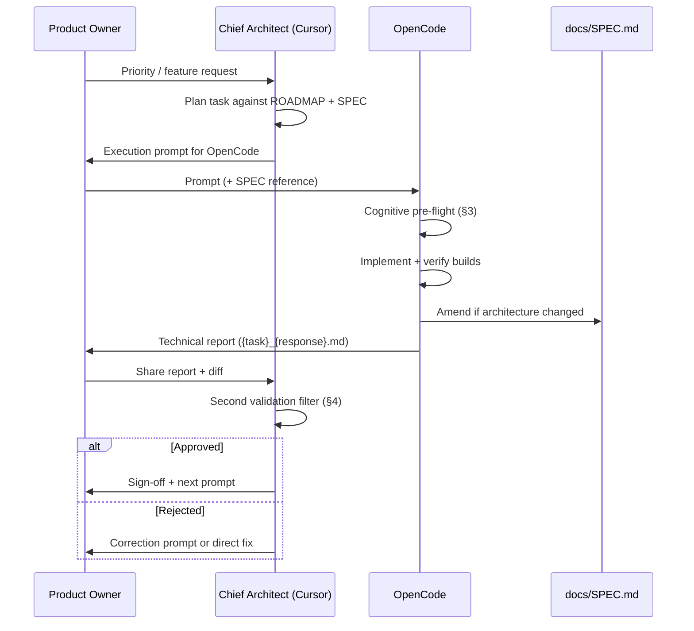

# Camaleon — Project Governance

> Defines roles, agent workflow, prompt standards, and validation gates.

---

## 1. Roles

### 1.1 Chief Architect — **Cursor**

| Responsibility | Detail |
|----------------|--------|
| Architecture | Owns `docs/SPEC.md`, `docs/ROADMAP.md`, and this document |
| Planning | Breaks roadmap phases into atomic, ordered tasks |
| Prompt authoring | Writes execution prompts for OpenCode |
| First filter | Reviews OpenCode technical reports against SPEC |
| Correction | Issues follow-up prompts or direct fixes when agent output diverges |
| SPEC authority | Final say on architectural decisions |

**Does not:** bulk implementation unless correcting critical drift or unblocking.

### 1.2 Implementation Agent — **OpenCode**

| Responsibility | Detail |
|----------------|--------|
| Execution | Implements prompts exactly; no stack substitutions |
| Cognition | Thinks before acting (see §3) |
| Reporting | Produces `{task}_{response}.md` in `docs/reports/` |
| SPEC maintenance | Updates `docs/SPEC.md` when changes affect architecture or contracts |
| Verification | Runs build commands; reports pass/fail honestly |

**Does not:** redefine MVP scope, rename modules, or skip SPEC updates.

### 1.3 Product Owner — **User (Dithmar)**

| Responsibility | Detail |
|----------------|--------|
| Direction | Sets priorities, approves roadmap shifts |
| Relay | Passes OpenCode reports to Cursor for validation |
| Gate | Accepts or rejects MVP milestones |

---

## 2. Workflow



---

## 3. Cognitive Directive (Mandatory in Every OpenCode Prompt)

Every prompt sent to OpenCode **must** include this block (verbatim or equivalent):

```
COGNITIVE DIRECTIVE — THINK BEFORE ACTING

Before writing or modifying any file:
1. Read docs/SPEC.md (especially §5 for engine work) and docs/ROADMAP.md. Identify which phase and acceptance criteria apply.
2. List dependencies, risks, and edge cases for this task.
3. Draft a mental execution plan and validate it against SPEC constraints.
4. Execute incrementally; after each major step, self-check against the plan.
5. Prefer correctness and SPEC compliance over speed.
6. If ambiguity exists, state your assumption explicitly in the technical report — do not silently guess on architectural decisions.

Do not skip this reasoning phase. Document key decisions in your technical report.
```

---

## 4. Validation Filters

### 4.1 OpenCode Self-Check (First Filter)

Before submitting the report, OpenCode confirms:

- [ ] All prompt requirements addressed
- [ ] `cargo check --workspace` passes
- [ ] `npm run build` passes (if frontend touched)
- [ ] SPEC updated if contracts/paths/structure changed
- [ ] No secrets committed; no `node_modules` / `target` staged
- [ ] Technical report complete (§5)

### 4.2 Chief Architect Review (Second Filter)

Cursor validates against:

| Check | Question |
|-------|----------|
| SPEC compliance | Does code match §3 structure, §5 module contracts, §6 frontend rules? |
| Roadmap alignment | Is this the correct phase? Scope creep? |
| Modularity | Transmutators independent? Shared code in `core_utils`? |
| Privacy | Any network call with file bytes? |
| Report quality | Decisions documented with rationale? |
| SPEC diff | Amendments accurate and versioned? |

**Outcomes:**

- **Approved** — task closed; next prompt issued
- **Conditional** — minor fixes listed; no re-prompt needed
- **Rejected** — correction prompt with explicit deltas

---

## 5. OpenCode Technical Report Format

**Filename:** `docs/reports/{task}_{response}.md`

- `{task}` — snake_case slug matching the prompt task ID (e.g. `phase1_wasm_pipeline`)
- `{response}` — `done`, `partial`, or `blocked`

**Required sections:**

```markdown
# Technical Report: {Task Title}

**Task ID:** {task}
**Status:** done | partial | blocked
**Date:** YYYY-MM-DD
**Agent:** OpenCode
**Model:** {model name}

## 1. Pre-Execution Analysis
(Risks, dependencies, plan — fulfills Cognitive Directive)

## 2. Work Performed
(Files created/modified; commands run)

## 3. Architectural Decisions
| Decision | Rationale | SPEC section affected |
|----------|-----------|----------------------|

## 4. Verification Results
| Command | Result | Notes |
|---------|--------|-------|

## 5. SPEC Amendments
(List changes to docs/SPEC.md, or "None")

## 6. Known Gaps / Follow-ups
(Items for Chief Architect or next task)

## 7. Deviations from Prompt
(Explicit list, or "None")
```

---

## 6. Prompt Template (Chief Architect → OpenCode)

```
SYSTEM DIRECTIVE: Act as a Senior Implementation Engineer for the Camaleon project.
Read docs/SPEC.md (especially §5 Transmutation Science for engine tasks) and docs/ROADMAP.md before any action.
All outputs strictly in English. No stack substitutions.

{COGNITIVE DIRECTIVE — see §3}

TASK ID: {task_slug}
PHASE: {roadmap phase}
OBJECTIVE: {one sentence}

REQUIREMENTS:
1. ...
2. ...

CONSTRAINTS:
- Must comply with docs/SPEC.md §{sections}
- Update docs/SPEC.md if this task changes architecture or contracts
- Do not modify docs/ROADMAP.md (Chief Architect owns roadmap)

DELIVERABLES:
- Code changes as specified
- docs/reports/{task_slug}_done.md

EXECUTION OUTPUT:
Do NOT dump raw code in chat. Output the technical report file only.
```

Archived prompts live in `docs/prompts/{task_slug}.md`.

---

## 7. Directory Conventions

| Path | Owner | Purpose |
|------|-------|---------|
| `docs/SPEC.md` | Cursor (OpenCode amends on task) | Architecture bible |
| `docs/ROADMAP.md` | Cursor | Delivery phases |
| `docs/GOVERNANCE.md` | Cursor | This file |
| `docs/prompts/` | Cursor | Prompt archive |
| `docs/reports/` | OpenCode | Technical reports |

---

## 8. Governance Change Log

| Date | Author | Change |
|------|--------|--------|
| 2026-06-02 | Chief Architect | Initial governance framework |
