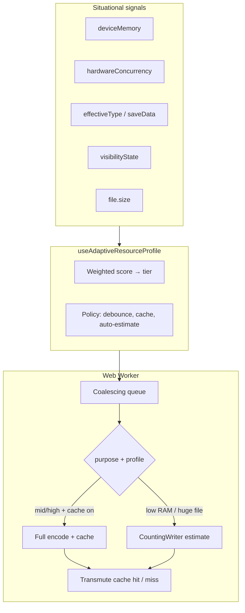

# Adaptive Resource Tuning — Worker + WASM Efficiency (All Environments)

> **Author:** Chief Architect (Cursor)  
> **Date:** 2026-06-06  
> **Status:** Planned — ready for OpenCode execution (unified prompt)  
> **Target release:** Frontend **v1.5.0** + Engine **v1.2.0**  
> **Builds on:** v1.3.0 metrics engine (`computeSizeDelta`, `useFileMetrics`, worker `purpose: "estimate"`)  
> **Executable prompt:** `docs/prompts/resource_tuning_engine.md` (Phases A + B + C — single document)

---

## 1. Context & Trigger

v1.3.0 delivers **accurate** size previews via a **full silent Wasm encode** in the Web Worker. Architect review (2026-06-06) identified:

| Layer | Cost | Role |
|-------|------|------|
| `computeSizeDelta` | Negligible | DRY formatting only |
| `useFileMetrics` + debounce | Low | Orchestration |
| WASM encode in Worker | **Dominant** | CPU + RAM |

**Audience:** majority mobile, but **desktop and laptop users must not be second-class**. A phone with 8 GB RAM and a budget laptop with 4 GB RAM share constraints; a gaming PC with 32 GB differs. Adaptation must be **situational** (hardware + network + file + tab state), not a manual “mobile mode” toggle or UA sniffing.

**Product constraint:** Keep the **accuracy contract** — when an estimate is shown, it must match real transmute output for identical options. No heuristic-only size math.

**Foundation:** Worker + Wasm stays (privacy NFR-1, responsiveness NFR-2, real codecs). Optimize **scheduling, memory sinks, and result reuse**.

---

## 2. Research — Adaptive Loading (Industry Pattern)

Google’s [Adaptive Loading](https://web.dev/articles/adaptive-loading-cds-2019) pattern (Osmani / Schloss): deliver a **fast core experience for everyone**, progressively enable expensive features only when signals allow.

| Signal | API | Camaleon use |
|--------|-----|--------------|
| Memory | `navigator.deviceMemory` (GB, Chrome/Android; **not Safari**) | Tier scoring, cache budget |
| CPU | `navigator.hardwareConcurrency` | Tier scoring, debounce |
| Network | `navigator.connection.effectiveType` | Tier scoring |
| Data saver | `navigator.connection.saveData` | Force conservative tier |
| Tab focus | `document.visibilityState` | Pause estimates when hidden |
| File context | `file.size` | Manual-estimate gate (any device) |

**Principles applied:**

1. **Score, don’t label** — no `if (mobile)`; compute a `ResourceProfile` from available signals.
2. **Progressive enhancement** — missing APIs → safe `mid` defaults (fair to Safari desktop + iOS).
3. **Situational overrides** — a 50 MB RAW export on a workstation still triggers manual estimate (file-size signal).
4. **No new npm deps** — implement `useAdaptiveResourceProfile` locally (avoid `react-adaptive-hooks`).

---

## 3. Why One Prompt (Phases A/B/C), Not Per-Environment Prompts

| Approach | Verdict |
|----------|---------|
| Separate “mobile prompt” + “desktop prompt” | **Rejected** — duplicates logic; environment is multidimensional; same code path must serve all |
| Separate prompt per phase (A, B, C) | **Rejected for now** — phases are tightly coupled (cache strategy depends on CountingWriter fallback) |
| **Single `resource_tuning_engine.md`** with phased gates | **Adopted** — one OpenCode run, one report, coherent SPEC amendment |

Phases are **technical delivery boundaries** (TS → Rust → cache), not user segments.

---

## 4. Unified Architecture — Three Phases



### Phase A — Adaptive scheduling (TypeScript only)

**Goal:** Eliminate redundant encodes and background work on **every** device.

| ID | Feature | All environments |
|----|---------|------------------|
| A1 | Worker estimate coalescing | One Wasm encode in flight; latest wins |
| A2 | Transmute preemption | User action always cancels pending estimate |
| A3 | Visibility pause | Hidden tab → no estimates (battery + CPU) |
| A4 | Score-based debounce | high 400ms / mid 600ms / low 800ms |
| A5 | File-size gate | Situational: huge file → manual button on any tier when over limit |
| A6 | Estimate input cache | One `ArrayBuffer` copy per file (never `staged.bytes`) |
| A7 | Scoped metrics mount | Estimation only when `staged` + `hasOptions` |
| A8 | Slider settle fast-path | `pointerup` / `change` → one immediate estimate |

### Phase B — Wasm size-only path (Engine v1.2.0)

**Goal:** When full output bytes are **not** needed, avoid allocating output `Vec<u8>`.

| ID | Feature |
|----|---------|
| B1 | `core_utils::CountingWriter` — `Write` impl counting bytes |
| B2 | `estimate_*_size` Wasm exports (png + jpg modules) |
| B3 | Worker routes estimate to size exports when **cache disabled** |

**CPU:** same encode work. **RAM:** saves output allocation (often 200 KB–5 MB).

### Phase C — Result cache (TypeScript + Worker)

**Goal:** **One encode** when estimate and transmute share options.

| ID | Feature |
|----|---------|
| C1 | Single-entry worker cache `{ fingerprint, bytes, mime, extension, outputSize }` |
| C2 | Fingerprint: `module + stableSerialize(options) + fileIdentity` |
| C3 | **Dual estimate strategy** (situational): |
| | **Cache enabled** (mid/high tier, file within budget): full encode, store bytes, return `outputSize` only |
| | **Cache disabled** (low tier or oversized): CountingWriter path (Phase B), no bytes stored |
| C4 | Transmute: fingerprint match → transfer cached bytes (**~0 encode**); miss → full encode |
| C5 | Invalidation: new file, options change, reset, `pagehide`, TTL 60s, budget exceeded |
| C6 | UI: `cacheWarm` removes `~` prefix; transmute shows instant feedback on hit |

**Desktop win:** powerful laptop gets 400ms debounce + cache → slider feels snappy, transmute instant.  
**Mobile win:** weak device gets counting estimate + no cache RAM → still accurate size, one encode on transmute.  
**Budget laptop win:** scored same as weak mobile — not “forgotten” because it’s not a phone.

---

## 5. `useAdaptiveResourceProfile` — Situational Scoring

### 5.1 Module layout

```
lib/device/
├── resource-profile.ts      # Pure scoring + policy (testable)
└── useAdaptiveResourceProfile.ts  # React hook: signals + listeners
```

### 5.2 Scoring model (0–100)

Start at **70** (neutral mid). Adjust:

| Signal | Condition | Δ score |
|--------|-----------|---------|
| `deviceMemory` | `<= 2` | −25 |
| | `<= 4` | −15 |
| | `>= 8` | +10 |
| `hardwareConcurrency` | `<= 2` | −20 |
| | `<= 4` | −10 |
| | `>= 8` | +10 |
| `effectiveType` | `slow-2g` / `2g` | −20 |
| | `3g` | −10 |
| `saveData` | `true` | −15 |
| `visibilityState` | `hidden` | pause only (no tier change) |

Clamp 0–100. Tier thresholds:

| Tier | Score | debounceMs | maxAutoEstimateBytes | enableResultCache | cacheMaxOutputBytes |
|------|-------|------------|----------------------|-------------------|---------------------|
| **high** | ≥ 65 | 400 | 40_000_000 | true | 25_000_000 |
| **mid** | 35–64 | 600 | 25_000_000 | true | 15_000_000 |
| **low** | < 35 | 800 | 15_000_000 | false | 0 |

`autoEstimate = fileSize <= maxAutoEstimateBytes` (all tiers).

**Manual estimate** when `!autoEstimate` OR user on low tier with file > 15 MB — copy is situational (“large file”), not “mobile only”.

### 5.3 Recomputation triggers

Hook re-runs profile when:

- `file.size` / file identity changes
- `connection` `change` event (Network Information API)
- `visibilitychange`
- Optional: `focus` / `blur` (resume estimates on focus)

Initial SSR: return `mid` defaults until `useEffect` hydrates signals.

### 5.4 Examples (not device labels)

| Scenario | Typical tier | Behavior |
|----------|--------------|----------|
| iPhone 15 Pro, 5 MB PNG, Wi‑Fi | mid (no deviceMemory) | 600ms debounce, cache on, fast transmute after estimate |
| Budget Android, 4 GB, 8 MB JPEG | low | 800ms, counting estimate, manual if >15 MB |
| MacBook Pro M3, 20 MB PNG | high | 400ms, full encode + cache, instant transmute |
| Office laptop 4 GB RAM, 12 MB file | low/mid | Same as budget phone — **not** desktop-default |
| Desktop, 45 MB file | any | `autoEstimate false` → manual button |
| Any device, tab backgrounded | — | Estimates paused |

---

## 6. File Touch Map & Estimated Diffs

| Phase | Files | ~LOC |
|-------|-------|------|
| **A** | `resource-profile.ts`, `useAdaptiveResourceProfile.ts`, worker coalescing, `useFileMetrics`, `useTransmutationWorker`, `TransmutationPanel`, i18n | 400 |
| **B** | `core_utils/counting_writer.rs`, both `lib.rs` estimate exports, worker routing, Rust tests | 180 |
| **C** | `workers/result-cache.ts`, worker cache R/W, hook `cacheWarm`, panel UX, SPEC | 250 |
| **Docs** | SPEC §7.2/§7.5/§7.8/§8, report | 40 |

**Total:** ~870 LOC across ~15 files.

---

## 7. Acceptance Criteria (All Phases)

### Phase A
- [ ] ≤1 Wasm encode in flight during rapid slider drag (any device)
- [ ] Hidden tab: zero estimates until visible
- [ ] Score-based debounce verified on simulated low/high profiles
- [ ] 45 MB file: manual estimate on desktop **and** mobile
- [ ] Buffer safety: `staged.bytes` valid after N estimates + transmute

### Phase B
- [ ] `estimate_*_size` === `transmute().len()` for same input/options (test matrix)
- [ ] CountingWriter path produces no output `Vec` allocation

### Phase C
- [ ] High-tier: estimate + transmute same options → **one** encode (worker counter)
- [ ] Low-tier: counting estimate + transmute → **one** encode on transmute only
- [ ] Cache hit: download bit-identical to non-cached path
- [ ] `pagehide` clears cache

### General
- [ ] `computeSizeDelta` unchanged as sole delta formatter
- [ ] `cargo test --workspace` + `npm run build` pass
- [ ] Frontend **v1.5.0**, Engine **v1.2.0**

---

## 8. Performance Targets

| Metric | v1.3.0 | After A+B+C (high tier) | After A+B+C (low tier) |
|--------|--------|-------------------------|------------------------|
| Encodes per 10 slider drags | Up to 10 | 1–2 | 1–2 |
| Encodes on happy-path transmute | 2 | **1** (cache) | **1** |
| Peak RAM during estimate (10 MB) | input + output | input + output (cached) | **input only** |
| Transmute after settled estimate | full encode | **< 50 ms** transfer | full encode |

Test matrix: iPhone Safari, mid Android Chrome, 4 GB laptop, desktop 16 GB.

---

## 9. Risks & Mitigations

| Risk | Mitigation |
|------|------------|
| Safari lacks `deviceMemory` | Default mid; use `hardwareConcurrency` when present |
| Cache RAM on mobile | `cacheMaxOutputBytes` per tier; disable cache on low |
| Coalescing + transmute race | Mutex: transmute preempts; single Wasm execution |
| Stale cache | Fingerprint includes options + file identity + TTL |

---

## 10. What Comes After

| Track | Relation |
|-------|----------|
| UI-8 Command Palette search | Independent |
| `refine_jpeg_encoder_swap` | Multiplies Phase B/C savings |
| Batch queue | Multi-entry cache |
| Playwright perf budgets | Measure encode counts per tier |

---

## 11. Document Index

| Document | Role |
|----------|------|
| `docs/planning/resource_tuning_adaptive_plan.md` | This file — architecture & scoring (Phases A–C overview) |
| `docs/prompts/resource_tuning_engine.md` | Executed — Phases A + B (v1.4.0) |
| `docs/planning/v1_5_0_phase_c_metrics_ux_plan.md` | Phase C + metrics UX animation (v1.5.0) |
| `docs/prompts/resource_tuning_phase_c.md` | **Next OpenCode prompt** — Phase C + centralized metrics animation |

**Superseded (deleted):** `resource_tuning_mobile_plan.md`, `resource_tuning_phase_a.md`
