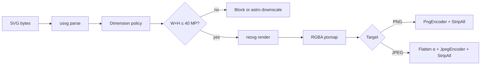

# Tier 3 Phase 3.3 — SVG Format Science & Transmutation Plan

> **Date:** 2026-06-11  
> **Status:** Analysis complete — **implementation blocked on 3.3.0 spike**  
> **Prerequisite:** Tier 3.2 AVIF encode pair ✅ (19 tools)  
> **Doctrine:** Same pipeline as Tiers 1–2 — parse → honest options → rasterize → re-encode → StripAll → estimate-first  
> **SPEC anchor:** §1.3 Ladder B · §5.1 mental model · §12.4 Tier 3 · NFR-7 bundle · NFR-8 honesty · **`docs/LIMIT_PIPELINE.md`**

---

## 0. Executive summary

**SVG (Scalable Vector Graphics)** is not an image codec. It is an **XML scene description**: paths, shapes, text, gradients, filters, and embedded rasters, resolved at **arbitrary resolution** only when rasterized.

Camaleon's Tier 3.3 job is therefore **not decode** in the AVIF sense, but **rasterization**:

```
SVG bytes → usvg (parse + normalize) → resvg (render to pixmap) → PNG or JPEG encode → StripAll
```

| Direction | In scope (MVP) | Fidelity label | Why |
|-----------|----------------|----------------|-----|
| **SVG → PNG** | ✅ | `lossless` (post-raster) | Universal pixmap; alpha preserved |
| **SVG → JPEG** | ✅ | `lossy` | Share / CMS / legacy upload; alpha flattened |

**Out of scope for 3.3:** raster → SVG (tracing), SVG → AVIF/WebP, SVG optimization, animation export, PDF, editing.

**Spike gate:** `resvg` + `usvg` Wasm build ≤ **3 MB** (NFR-7); ≤ 4 MB absolute (§12.4).

---

## 1. What SVG is (format science)

### 1.1 Layer model

```
.svg bytes (UTF-8 XML, optionally gzip)
  └── Document structure
        ├── <svg> root — width, height, viewBox, preserveAspectRatio
        ├── Scene graph — <g>, <path>, <rect>, <circle>, <text>, <image>, …
        ├── Presentation — fill, stroke, opacity, transform, clip-path, mask
        ├── Styling — inline attributes, <style>, CSS classes, @media
        ├── Definitions — <defs>, gradients, patterns, symbols, <use>
        ├── Filters — <filter> (blur, merge, color matrix, …)
        └── Embedded content — raster <image>, fonts, foreignObject (HTML)
              └── Rasterize at chosen width×height → sRGB RGBA pixmap
```

| Layer | Role | Camaleon analogy |
|-------|------|------------------|
| **Container** | XML text (often small for icons/logos) | Unlike ISOBMFF/RIFF — no compressed pixel grid |
| **Geometry** | Vectors + transforms | "Infinite" resolution until we pick output pixels |
| **Presentation** | Colors, strokes, compositing | Becomes fixed pixels at rasterize time |
| **Text** | Outlines from font glyphs | **Font-dependent** — unlike raster codecs |
| **Embedded rasters** | JPEG/PNG inside `<image>` | Decoded as part of scene; still vector wrapper |

**References:** [SVG 1.1 (W3C)](https://www.w3.org/TR/SVG11/) · [SVG 2 (W3C)](https://www.w3.org/TR/SVG2/) · resvg targets **Micro SVG** (practical web subset).

### 1.2 Scientific properties (why users have SVG files)

| Property | Detail |
|----------|--------|
| **Resolution independence** | Same file scales from favicon to billboard — **until** rasterized |
| **Compact for flat graphics** | Logos, icons, UI assets — often KB vs MB for equivalent PNG |
| **Editable in design tools** | Figma, Illustrator, Inkscape — export SVG for web |
| **Web-native** | Inline in HTML, CSS `background-image`, favicons (SVG favicon exists but Camaleon targets raster export) |
| **Transparency** | Alpha via opacity, masks, rgba fills — maps to RGBA pixmap |
| **Not a photo format** | Photos inside SVG are **embedded rasters**, not vector detail |
| **Spec breadth** | Full SVG 1.1/2 is huge; real-world files vary wildly in complexity |

### 1.3 How SVG differs from AVIF / WebP / JPEG (critical for honesty)

| Aspect | Raster codecs (AVIF, WebP, JPEG, PNG) | SVG |
|--------|----------------------------------------|-----|
| **Representation** | Compressed pixel grid | Mathematical scene + optional embedded images |
| **Camaleon "decode"** | Decompress to fixed W×H raster | **Parse + render** at **user-chosen** W×H |
| **Re-size without re-export** | Lossy (JPEG) or resample (PNG) | Native strength — **we destroy this** when rasterizing |
| **Alpha** | Channel or auxiliary plane | Compositing model → RGBA pixmap |
| **Metadata** | EXIF/XMP/ICC in container | XML comments, `<metadata>`, editor names — StripAll |
| **Fidelity story** | Codec generation loss | **Resolution + renderer + fonts** loss |

**NFR-8 implication:** SVG → PNG is **not** "lossless preservation of the asset." It is **lossless storage of the rasterized result at the chosen size.** Copy must say: *vector converted to pixels at N×M*.

---

## 2. User jobs (why SVG → raster in Camaleon)

| Use case | Why transmute locally |
|----------|----------------------|
| **Icon / logo → PNG for app store** | Stores require fixed-size PNG; designer has SVG |
| **Web asset → slide / Word / PDF pipeline** | Tools that reject SVG |
| **Figma / Illustrator export → JPEG share** | Client wants photo-like flat export without Illustrator |
| **SVG favicon / sprite → raster thumbnail** | CMS image field accepts JPEG only |
| **Privacy** | Marketing SVG with embedded metadata — convert without upload (P1) |
| **Email / chat preview** | Recipients on clients without SVG preview |

We do **not** optimize for: SVG → SVG minify (Tier 4a), auto-trace photo → SVG (different product), or SVG animation → GIF/WebP (deferred).

---

## 3. Pipeline fit (§5.1 mental model)

Camaleon invariant:

```
Input bytes → Decode to in-memory raster → Re-encode under target rules → Output bytes
```

For SVG, **decode = rasterize**:

```
SVG bytes
  → validate_input (byte cap)
  → inspect_svg_meta (intrinsic size, viewBox, flags) — BEFORE full render when possible
  → usvg::Tree::from_data (parse; reject/block external refs)
  → resolve_output_dimensions (intrinsic × user scale OR explicit W×H)
  → enforce MAX_PIXELS (40 MP) on **output** raster — docs/LIMIT_PIPELINE.md
  → resvg::render → Pixmap (sRGB RGBA)
  → semantic_alpha assess (meaningful alpha for JPEG path)
  → StripAll on output
  → encode PNG (compression 1–9) OR JPEG (quality + background)
```



**Astro downscale:** Applies to **output pixel count**, not SVG file bytes. A 2 KB SVG can rasterize to 80 MP if user requests 12000×7000 — same LimitContext UX as huge PNG.

---

## 4. Transmutation targets — what and why

### 4.1 SVG → PNG ✅

| | |
|--|--|
| **Encoding** | Lossless spatial (DEFLATE); alpha preserved when meaningful |
| **Fidelity** | `lossless` — *for the rasterized pixmap*; PNG level affects bytes only |
| **Reuse** | Same `PngEncoder` path as `transmutador_webp`, `transmutador_avif` |
| **User knobs** | Output dimensions (or scale), PNG compression 1–9 |

### 4.2 SVG → JPEG ✅

| | |
|--|--|
| **Encoding** | Lossy DCT; no alpha channel |
| **Fidelity** | `lossy` — anti-aliased edges re-compressed; alpha flattened |
| **Reuse** | Quality + background RGB (existing `BackgroundColorPill` pattern) |
| **User knobs** | Output dimensions, JPEG quality, background color |

### 4.3 Explicitly not shipping in 3.3

| Direction | Reason |
|-----------|--------|
| **SVG → AVIF** | Niche; AVIF shines on photos; flat graphics often larger than optimized SVG; adds encode latency + second modern codec story |
| **SVG → WebP** | Tier 1 WebP suite complete; low incremental user job |
| **Raster → SVG** | Tracing / vectorization — different algorithms (potrace, vtracer); not format transmutation |
| **SVG → SVG** | Optimization (svgo) — Tier 4a ladder C |
| **SVG → ICO** | Could reuse PNG path + ICO encoder later; not MVP |
| **Animated SVG → frames** | SMIL/CSS animation — scope creep; Q6 |

---

## 5. Modifiable parameters (user-facing vs engine)

### 5.1 Tier 3.3 MVP sliders / controls

| Parameter | Type | Range / default | Phase | Notes |
|-----------|------|-----------------|-------|-------|
| **Output width** | `u32` | intrinsic or user | 3.3.1+ | Paired with height; aspect lock recommended |
| **Output height** | `u32` | intrinsic or user | 3.3.1+ | Product of W×H drives memory + CPU |
| **Scale preset** | enum or % | 100%, 200%, 512px, 1024px, … | 3.3.1 | UX sugar over W×H — match ICO/resize patterns |
| **PNG compression** | `u8` | 1–9, default **6** | 3.3.1 | Same as all PNG outbound tools |
| **JPEG quality** | `u8` | 1–100, default **85** | 3.3.2 | Same as all JPEG outbound tools |
| **Background color** | RGB | default **white** | 3.3.2 | Flatten transparent areas for JPEG |

### 5.2 Engine parameters (`usvg::Options` — spike decides exposure)

| Parameter | Default (usvg) | Expose in UI? | Rationale |
|-----------|----------------|---------------|-----------|
| **`dpi`** | 96.0 | Optional advanced | Converts `pt`, `in`, `cm` to px; tied to scale |
| **`default_size`** | 300×150 | No (use intrinsic) | SVG spec fallback when width/height missing |
| **`font_family`** | system fallback | No MVP | Use bundled fallback + embedded fonts |
| **`shape_rendering`** | default | No MVP | Crisp vs smooth edges — power-user |
| **`text_rendering`** | default | No MVP | |
| **`image_rendering`** | default | No MVP | |
| **`languages`** | `["en"]` | No | Text `lang` attribute selection |
| **`resources_dir`** | None | **Blocked** | No filesystem in browser Wasm |
| **`image_href_resolver`** | custom | **Security** | Only `data:` URIs; reject `http(s)://`, `file://` |
| **`font_resolver`** | custom | Spike | `data:` font bytes; reject external |
| **`fontdb`** | embedded subset | Spike | Ship minimal Latin font(s) in crate |
| **`style_sheet`** | None | No MVP | User-supplied CSS injection — XSS surface |

### 5.3 Derived / read-only (prepare / inspect)

| Field | Source | Use |
|-------|--------|-----|
| **Intrinsic width / height** | `tree.size()` after parse | Default output dimensions |
| **viewBox** | root `viewBox` | Aspect ratio when only viewBox present |
| **has_text** | tree walk | Honesty hint if fonts may substitute |
| **has_filters** | tree walk | Performance warning (heavy SVG) |
| **has_external_refs** | parse errors / resolver | Block or warn before render |
| **embedded_raster_count** | tree walk | Explain photo-in-SVG behavior |

---

## 6. Dimension logic (hardest product decision)

SVG output size is **not** fixed in the file the way AVIF `ispe` is.

### 6.1 Resolution order (proposal)

1. **Parse** with `usvg::Tree::from_data`.
2. Read **`tree.size()`** — logical size in pixels at `Options.dpi` (default 96).
3. If user supplied **explicit W×H** → apply scale transform to root (`resvg::Transform::from_scale`).
4. If user supplied **scale %** → `out_w = intrinsic_w * scale`, same for height.
5. If **only viewBox** (no width/height) → usvg applies `default_size` or viewBox mapping — **document in honesty copy**.
6. **Round** to integer pixels; reject if `w * h > MAX_PIXELS`.

### 6.2 Aspect ratio

| Mode | Behavior |
|------|----------|
| **Lock aspect** (default) | Changing width adjusts height from viewBox ratio |
| **Stretch** | Advanced / backlog — distorts if W/H ratio ≠ viewBox |

Match Tier 4a resize UX when it ships; for 3.3 use **lock** only.

### 6.3 DPI vs explicit pixels

- **DPI** matters for files using physical units (`10pt` text, `2cm` margin).
- **Web SVG** usually uses `px` or unitless viewBox — DPI rarely user-visible.
- **Proposal:** engine uses 96 DPI; UI speaks in **pixels** and **scale %**, not DPI.

---

## 7. Backend — `resvg` + `usvg` (spike-gated)

### 7.1 Why resvg

| Criterion | resvg / usvg |
|-----------|--------------|
| **Language** | Pure Rust — matches motor_transmutacion |
| **Wasm** | `wasm32-unknown-unknown` supported (resvg-js proves viability) |
| **Maintenance** | Linebender / community — active |
| **Spec scope** | Micro SVG — honest subset (not full Adobe Illustrator compatibility) |
| **Output** | sRGB RGBA via tiny-skia pixmap |
| **Security** | No script execution; we still block network fetches |

**Alternatives rejected:**

| Option | Why not |
|--------|---------|
| **Browser `` + canvas** | Breaks Rust engine symmetry; CORS/font/network behavior differs per browser |
| **librsvg (C)** | C glue + Wasm fragility — same class as libavif rejection |
| **nanosvg** | C; less maintained for full SVG feature set |

### 7.2 Spike gates (3.3.0)

Adopt **resvg + usvg** if all pass:

1. `wasm-pack build --target web --release` for `transmutador_svg` skeleton.
2. `.wasm` ≤ **3 MB** uncompressed (NFR-7); ≤ 4 MB absolute.
3. Renders fixture set (§7.4) with correct alpha on PNG path.
4. `inspect_svg_meta` returns dimensions **without** full pixmap alloc when possible.
5. External `href` blocked with honest error — no network from Wasm.
6. `cargo test --workspace` passes.
7. Text fixture renders with **bundled font** (not tofu).

Document in `docs/planning/tier3_3_svg_spike_results.md` (create after 3.3.0).

### 7.3 Bundle size expectations

| Component | Est. contribution |
|-----------|-------------------|
| resvg + usvg + tiny-skia | ~1.2–2.0 MB optimized |
| fontdb + embedded font subset | +200–800 KB |
| png/jpeg encode (image crate) | shared pattern with other crates |
| **Total** | SPEC table **~2–4 MB** — spike required |

**Size tactics:** `default-features = false`, LTO, `opt-level = "z"`, wasm-opt, minimal font subset, no unused usvg features.

**Risk:** resvg-js 2.5.0 reportedly **doubled** Wasm size — pin versions in spike; do not assume 1.3 MB.

### 7.4 Fixture matrix (3.3.0)

| Fixture | Parse | Render | Notes |
|---------|-------|--------|-------|
| **simple_icon** | ✅ | ✅ | Single path, viewBox |
| **gradient_logo** | ✅ | ✅ | Linear/radial gradient |
| **text_latin** | ✅ | ✅ | Requires bundled font |
| **text_embedded_font** | ✅ | ✅ | `data:font/woff2` |
| **embedded_png** | ✅ | ✅ | `<image href="data:...">` |
| **alpha_mask** | ✅ | ✅ | Meaningful alpha → PNG RGBA |
| **filters_blur** | ✅ | ✅ | Performance baseline |
| **external_href** | reject | — | `href="https://..."` blocked |
| **huge_viewbox_scale** | ✅ | reject | W×H > 40 MP before render |
| **corrupt_xml** | error | — | Honest `String` errors |
| **gzip_svg** | ✅ | ✅ | `from_data` supports gzip |

---

## 8. Security & sandboxing

| Threat | Mitigation |
|--------|------------|
| **External image URLs** | Custom `ImageHrefResolver` — allow `data:` only |
| **External fonts** | Custom `FontResolver` — `data:` + bundled fonts only |
| **XXE / billion laughs** | usvg parser limits; byte cap via `validate_input` |
| **Script / onclick** | usvg does not execute script — document; strip unknown elements if needed |
| **foreignObject (HTML)** | resvg limited support — honesty hint when render differs |
| **Quadratic blow-up** | `MAX_PIXELS` + optional path complexity timeout (spike measure) |

---

## 9. Wasm API contract (proposed — stub before code)

Crate: `motor_transmutacion/transmutador_svg`  
Crate type: `["cdylib", "rlib"]`  
Dependencies: `resvg`, `usvg`, `core_utils`, `image` (`png` + `jpeg` only).

```rust
// --- Meta / prepare ---
inspect_svg_meta(bytes) -> SvgMeta {
    intrinsic_width, intrinsic_height,
    has_view_box, has_text, has_filters,
    has_external_refs, embedded_raster_count
}

// --- Semantic alpha (after rasterize or sample render — spike chooses) ---
assess_alpha_from_raster(pixmap_bytes) -> AlphaAssessmentJs  // or assess on render buffer

// --- SVG → PNG ---
transmutar_svg_a_png(bytes, out_w, out_h, compression) -> Vec<u8>
estimate_svg_to_png_size(bytes, out_w, out_h, compression, alpha_hint) -> u32

// --- SVG → JPEG ---
transmutar_svg_a_jpg_with_options(bytes, out_w, out_h, quality, bg_r, bg_g, bg_b) -> Vec<u8>
estimate_svg_to_jpg_size(bytes, out_w, out_h, quality, bg_r, bg_g, bg_b, alpha_hint) -> u32

set_session_input_limit / reset_session_input_limit
```

**Policies:**

- StripAll (§5.10) — SVG `<metadata>`, editor comments, custom XML not propagated to PNG/JPEG.
- `validate_input` + probe for SVG magic (`<?xml`, `<svg`, optional gzip).
- `validate_output` — `OutputFormat::Png` | `Jpeg`.
- Output dimensions validated against `MAX_PIXELS` **before** pixmap allocation.

---

## 10. Frontend integration (mirror AVIF / WebP)

| Step | Work |
|------|------|
| ToolRegistry | `svg-to-png`, `svg-to-jpg` — `status: "soon"` until spike passes |
| Worker | `initSvgWasm` lazy-load; `TransmutationModule` += `"transmutador_svg"` |
| Options UI | Dimension controls (W×H or scale presets) + compression / quality / background |
| Prepare | `inspect_svg_meta` with session limit; show intrinsic size |
| LimitContext | 40 MP on **output** W×H; astro downscale before render |
| i18n | Fidelity hints, font substitution, renderer subset honesty |
| MIME | `image/svg+xml`, extension `.svg` |

**End state after 3.3.2:** **21 active tools** (19 + 2 SVG outbound).

---

## 11. Size estimation

| Path | Approach |
|------|----------|
| **SVG → PNG** | Prefer `CountingWriter` on `PngEncoder` after rasterize — same as WebP→PNG if raster buffer cached |
| **SVG → JPEG** | Full encode for estimate (acceptable) or counting writer |

**Cost:** Estimate requires **parse + render** at chosen size — same order as transmute. Coalesce slider updates (v1.12.2 pattern). Heavy SVG + large output → friendly "this may take a moment" copy (same class as AVIF encode backlog).

---

## 12. Open decisions (resolve in 3.3.0 spike)

| # | Question | Default proposal | Resolve in |
|---|----------|------------------|------------|
| **Q1** | Default output size when user does not change sliders? | **Intrinsic `tree.size()`** at 96 DPI | 3.3.0 |
| **Q2** | Missing width/height, viewBox only? | usvg default + show computed intrinsic in UI | 3.3.0 |
| **Q3** | External `href`? | **Hard reject** with i18n `svgExternalReferenceNotSupported` | 3.3.0 |
| **Q4** | Font strategy? | **Bundle Noto Sans or DejaVu subset** (~200–400 KB) + honor `data:` fonts | 3.3.0 |
| **Q5** | Text mismatch honesty? | **Yes** — `svgFontSubstitutionHint` when `has_text` && no embedded font | 3.3.1 |
| **Q6** | Animated SVG (SMIL/CSS)? | **Static first frame** + backlog OR reject with i18n | 3.3.0 |
| **Q7** | `foreignObject`? | Render what resvg supports; honesty hint on failure | 3.3.0 |
| **Q8** | Max output dimension cap? | **40 MP** only (no arbitrary 16k edge) unless astro UI applies | 3.3.1 |
| **Q9** | Alpha assess timing? | Full rasterize in prepare only if W×H ≤ 40 MP | 3.3.2 |
| **Q10** | gzip `.svgz` input? | **Accept** via `from_data` | 3.3.0 |

---

## 13. Phase checklist

### 3.3.0 — SVG rasterize spike

- [ ] Crate `transmutador_svg` skeleton + `wasm-pack` release build
- [ ] Measure `.wasm` size; font embedding strategy
- [ ] Fixture matrix §7.4
- [ ] Security: external href blocked
- [ ] `tier3_3_svg_spike_results.md`
- [ ] Chief Architect go/no-go

### 3.3.1 — SVG → PNG

- [ ] `inspect_svg_meta`, dimension UI, compression slider
- [ ] `estimate_svg_to_png_size`
- [ ] ToolRegistry `svg-to-png` → `active`
- [ ] i18n EN/ES + fidelity hints

### 3.3.2 — SVG → JPEG

- [ ] Quality + background options
- [ ] `assess_alpha` / transparency notice on JPEG path
- [ ] ToolRegistry `svg-to-jpg` → `active`
- [ ] Manual smoke + StripAll integration tests

---

## 14. Risk matrix

| Risk | Impact | Mitigation |
|------|--------|------------|
| **Wasm > 3 MB** | Blocks merge | Minimal font subset; feature flags; version pin |
| **Illustrator ≠ resvg** | User trust | NFR-8 Micro SVG subset + font hints |
| **Tiny SVG → huge raster** | OOM / freeze | `MAX_PIXELS` on output; astro downscale |
| **External refs in wild SVG** | Broken render | Hard reject with clear error |
| **Filter-heavy SVG slow** | UX | Performance warning; worker isolation |
| **Text without embedded font** | Wrong glyphs | Bundled font + honesty copy |
| **Estimate = full render** | Slider lag | Coalescing; debounce (v1.12.2) |

---

## 15. Comparison tables

### 15.1 SVG vs AVIF (Tier 3 siblings)

| Aspect | AVIF (3.1–3.2) | SVG (3.3) |
|--------|----------------|-----------|
| **Input nature** | Compressed raster | Vector scene |
| **Core operation** | Decode / encode AV1 | Parse + rasterize |
| **Size knob** | Quality / speed (encode) | **Output W×H** |
| **CPU profile** | AV1 decode/encode heavy | Path/filter rasterization |
| **Alpha** | Auxiliary AV1 item | Compositing → RGBA |
| **Honesty axis** | Generational loss | **Resolution + renderer** |

### 15.2 SVG vs WebP (Tier 1 reference)

| Aspect | WebP | SVG |
|--------|------|-----|
| **Camaleon crate** | `transmutador_webp` | `transmutador_svg` |
| **Decode** | VP8/VP8L → raster | XML → raster |
| **Outbound targets** | PNG, JPEG | PNG, JPEG (same) |
| **Prepare probe** | RIFF header | `inspect_svg_meta` |

---

## 16. Related backlog (not 3.3)

| Item | Notes |
|------|-------|
| **AVIF encode slow UX** | ✅ Shipped via **Operational Notice Rail** (`docs/planning/notice_system_plan.md`) — Phases A–D |
| **SVG rasterize slow UX (Phase E)** | Wire `transmutador_svg` in `tool-notice-profiles.ts`: `estimateCost/transmuteCost: expensive`; factors `outputWidth`, `outputHeight`, `has_filters`; reuse `notices.estimate.fullRender` pattern |
| **SVG → AVIF** | Revisit after 3.3 stable if demand |
| **SVG animation export** | GIF/WebP sequence — far horizon |
| **Raster → SVG trace** | Different ladder — not format swap |

---

## 17. Related documents

| Document | Role |
|----------|------|
| `docs/planning/tier3_plan.md` | Tier 3 umbrella + execution order |
| `docs/SPEC.md` §12.4 | Normative Tier 3 table |
| `docs/LIMIT_PIPELINE.md` | 40 MP + session bytes |
| `docs/planning/tier3_1_avif_spike_results.md` | Spike doc pattern |
| `docs/planning/tier3_2_avif_encode_spike_results.md` | Encode spike pattern |
| `docs/planning/tier3_3_svg_spike_results.md` | **Create after 3.3.0** |
