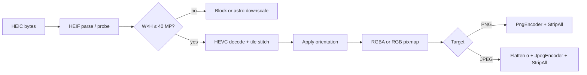

# Tier 3 Phase 3.4 — HEIC/HEIF Format Science & Transmutation Plan

> **Date:** 2026-06-11  
> **Status:** Analysis complete — **implementation blocked on 3.4.0 spike**  
> **Prerequisites:** v2.3.8 on `main` — **21 tools**, AVIF suite, SVG→PNG/JPEG (3.3 ✅), Notice Rail (v2.3.0), Settings S1–S4 + **S6 Risk mode** (v2.3.8)  
> **Implementation plan:** `docs/planning/tier3_4_heic_implementation_plan.md` *(create after spike go/no-go)*  
> **Target versions:** v2.4.x (spike + HEIC→JPEG) · v2.4.x+ (HEIC→PNG optional)  
> **Doctrine:** Same pipeline as Tiers 1–2 — decode → honest options → re-encode → StripAll → estimate-first  
> **SPEC anchor:** §1.3 Ladder B · §5.1 mental model · §12.4 Tier 3 · NFR-7 bundle · NFR-8 honesty · **`docs/LIMIT_PIPELINE.md`**

---

## 0. Executive summary

**HEIF (High Efficiency Image File Format, ISO/IEC 23008-12)** is an **ISOBMFF container** (same structural family as MP4 and AVIF) that stores one or more **coded image items** plus metadata. **HEIC** is the **de-facto Apple profile**: HEIF files whose primary still images are **HEVC (H.265) intra-coded** bitstreams — the default iPhone camera format since iOS 11.

Camaleon's Tier 3.4 job is **decode-only**, mirroring AVIF 3.1 — not re-encoding to HEIC (HEVC encode is patent-sensitive, slow, and out of product scope):

```
HEIC bytes → parse HEIF container → HEVC decode → RGB/RGBA raster → JPEG or PNG encode → StripAll
```

| Direction | In scope (MVP) | Fidelity label | Why |
|-----------|----------------|----------------|-----|
| **HEIC → JPEG** | ✅ primary | `lossy` | Highest user demand — share iPhone photos everywhere |
| **HEIC → PNG** | ✅ optional (3.4.2) | `lossless` (post-decode) | Edit / composite / alpha preservation |

**Out of scope for 3.4:** JPEG/PNG → HEIC encode, Live Photo video track export, depth-map reconstruction, HDR gain-map recovery, HEIC sequence → GIF/WebP, batch album tools.

**Spike gate:** Wasm decode backend ≤ **3 MB** (NFR-7); ≤ 4 MB absolute (§12.4). SPEC's older note ("no pure-Rust decoder") is **stale** — the **`heic`** crate (imazen, pure Rust HEVC + HEIF parse, `wasm32-unknown-unknown`) is now the **primary spike candidate**; `libheif` remains fallback B if A fails size or fixture coverage.

---

## 1. What HEIC is (format science)

### 1.1 Layer model

```
.heic / .heif bytes
  └── ISOBMFF boxes (ftyp, meta, mdat, …)
        ├── ftyp — brands: heic, heix, mif1, msf1, …
        ├── meta — item location, properties, EXIF/XMP refs
        │     ├── iprp / ipco — item properties
        │     │     ├── ispe — Image Spatial Extents (W×H per item)
        │     │     ├── hvcC — HEVC Decoder Configuration Record
        │     │     ├── colr — colour information (ICC, nclx)
        │     │     ├── irot / imir — orientation (metadata-only transform)
        │     │     └── auxC — auxiliary image subtype (alpha, depth, …)
        │     └── iloc / iinf — coded item byte ranges
        └── mdat — HEVC NAL units (VPS/SPS/PPS + slice data)
              └── HEVC intra decode → YCbCr planes → RGB/RGBA raster
```

| Layer | Role | Camaleon analogy |
|-------|------|------------------|
| **Container (HEIF)** | Item directory, thumbnails, aux planes, metadata | **Same class as AVIF** — both are HEIF profiles on ISOBMFF |
| **Codec (HEVC / H.265)** | Still-image compression via **intra** pictures (I-slices) | Heavier than JPEG DCT; similar CPU class to AV1 decode |
| **Grid items (`grid`)** | Large photos split into **tiles** (often 512×512 on iPhone) | Affects memory/CPU — decoder must stitch tiles |
| **Auxiliary items** | Separate coded planes: alpha mask, depth, HDR gain map | Alpha → meaningful transparency; depth/HDR → honesty only in MVP |

**Naming (precision matters for NFR-8):**

| Term | Meaning |
|------|---------|
| **HEIF** | Container standard — can hold HEVC, AV1 (`avif`), JPEG, uncompressed, sequences |
| **HEIC** | HEIF + HEVC still images — `.heic`, MIME `image/heic` |
| **HEICS** | HEIF image **sequence** (burst/Live Photo still sequence) |
| **AVIF** | HEIF + AV1 — already shipped in Tier 3.1 (`transmutador_avif`) |

**References:** [HEIF technical overview (Nokia)](http://nokiatech.github.io/heif/technical.html) · [ISO/IEC 23008-12](https://www.iso.org/standard/89035.html) · [HEVC (ISO/IEC 23008-2 / H.265)](https://www.itu.int/rec/T-REC-H.265) · Apple WWDC 2017 HEIF session · SPEC §12.4.

### 1.2 Scientific properties (why users have HEIC files)

| Property | Detail |
|----------|--------|
| **Compression efficiency** | Typically **~40–50% smaller** than JPEG at similar visual quality for photos (content-dependent) |
| **Apple ecosystem default** | iPhone/iPad camera → `.heic`; macOS Photos; AirDrop |
| **Still = HEVC intra** | No inter-frame prediction for single photos — each image is decodable independently |
| **Tiled storage** | Large images as `grid` of HEVC tiles — decoder stitches to full raster |
| **Thumbnails** | Smaller `ispe` items in same file — spike must pick **primary** display item |
| **Alpha** | Often a **separate auxiliary image item** (not RGBA in one HEVC plane) — merge like AVIF aux alpha |
| **Depth / portrait** | Auxiliary depth map + segmentation matte — common in iPhone portraits; MVP: ignore for output, honesty hint |
| **HDR / wide gamut** | 10-bit HEVC + optional HDR gain map item — MVP: **8-bit SDR** output policy (match AVIF) |
| **Orientation** | `irot` / `imir` in container — **must apply to pixels** before re-encode (StripAll removes metadata) |
| **Patent / licensing** | HEVC patent pool — **decode in browser** is the product bet; we do not ship HEVC **encode** |

### 1.3 How HEIC differs from AVIF / JPEG / SVG (critical for honesty)

| Aspect | HEIC (3.4) | AVIF (3.1–3.2) | JPEG | SVG (3.3) |
|--------|------------|----------------|------|-----------|
| **Container** | HEIF / ISOBMFF | HEIF / ISOBMFF | None (raw markers) | XML |
| **Codec** | HEVC intra | AV1 | DCT | N/A (rasterize) |
| **Camaleon operation** | **Decode** HEVC + parse HEIF | **Decode** AV1 + parse HEIF | Decode DCT | Parse + render |
| **Fixed output W×H** | Yes (`ispe` on primary item) | Yes (`ispe`) | Yes | **User-chosen** at rasterize |
| **Alpha model** | Auxiliary item common | Auxiliary AV1 item | None | Compositing → RGBA |
| **Typical user pain** | "Windows/web won't open iPhone photo" | Same, newer codec | Universal | "Need PNG from logo" |
| **Generational loss → JPEG** | Lossy HEVC → lossy JPEG | Lossy AV1 → lossy JPEG | N/A | Raster → JPEG |

**Sibling insight:** `transmutador_avif` already parses HEIF-shaped containers for AV1 items. HEIC reuses the **same product pattern** (probe → decode → PNG/JPEG) but needs a **HEVC decoder**, not AV1.

---

## 2. User jobs (why HEIC → raster in Camaleon)

| Use case | Why transmute locally |
|----------|----------------------|
| **iPhone photo → email / CMS / legacy app** | Recipient or uploader accepts JPEG/PNG only |
| **HEIC on Windows / older Android** | OS or app lacks HEIC codec |
| **Designer received `.heic` from client** | Photoshop / GIMP / Figma want PNG |
| **Privacy** | Medical or personal photos — convert without cloud upload (P1) |
| **Alpha / transparency → JPEG share** | PNG with alpha aux → flattened JPEG for social |
| **Batch one-off** | Single-file tool matches Camaleon doctrine — not album manager |

We do **not** optimize for: Live Photo **video** export, depth-based bokeh re-render, HDR recovery to display-referred HDR PNG, or re-encoding to HEIC (encode out of scope).

---

## 3. Pipeline fit (§5.1 mental model)

Camaleon invariant:

```
Input bytes → Decode to in-memory raster → Re-encode under target rules → Output bytes
```

For HEIC:

```
HEIC bytes
  → validate_input (byte cap)
  → inspect_heic_meta (dimensions, has_alpha, grid, orientation, is_sequence) — BEFORE full decode
  → select primary image item (not thumbnail / not depth aux)
  → HEVC decode (+ merge alpha aux if present)
  → apply orientation (irot/imir) to pixel buffer
  → normalize to 8-bit RGB/RGBA (10-bit → 8-bit policy)
  → semantic_alpha assess (meaningful alpha for JPEG path)
  → StripAll on output
  → encode JPEG (quality + background) OR PNG (compression 1–9)
```



**Astro downscale:** Applies to **decoded pixel count** (same as AVIF/WebP). Session byte limits and Risk mode (S6) apply per `docs/LIMIT_PIPELINE.md`.

---

## 4. Encode/decode algorithmic logic

Understanding HEIC helps set honest UX and spike fixtures — users never touch these knobs, but implementers must.

### 4.1 Container parse (HEIF / ISOBMFF)

1. Read `ftyp` — confirm compatible brands (`heic`, `heix`, `mif1`, …). Reject unknown/non-image brands early.
2. Walk `meta` → `iprp` → `ipco` properties per **item ID**.
3. **`ispe`**: width × height — use for **LimitContext before decode** (40 MP gate).
4. **`iloc` + `mdat`**: locate coded bitstream bytes for each item.
5. Classify items: primary image, thumbnail, `grid` composite, auxiliary (alpha/depth/gain-map).
6. Read **`irot` (0–3)** and **`imir` (axis)** — queue orientation fix after decode.
7. Optional **`colr`**: ICC or `nclx` — MVP decode to sRGB 8-bit; do not propagate ICC (StripAll).

### 4.2 HEVC still-image decode

HEIC photos are **intra-coded HEVC pictures** (no temporal prediction for single stills):

1. Parse **`hvcC`** — SPS/PPS/VPS for the item's HEVC profile (Main Still Picture, Main 10, etc.).
2. Entropy-decode slice NAL units → transform coefficients.
3. **Intra prediction** — directional modes reconstruct luma/chroma blocks.
4. **Inverse transform + dequant** → residual added to prediction.
5. **Deblocking / SAO** (in-loop filters) → reconstructed YCbCr planes.
6. **Chroma upsampling** (4:2:0 typical) → full-resolution YCbCr.
7. **Color conversion** BT.601/BT.709/BT.2020 per VUI → **RGB or RGBA**.

**Grid (`grid`) items:** each tile is a separate HEVC item with its own `ispe`; decoder renders tiles into a canvas at `grid` offsets — iPhone 12MP+ photos commonly use this.

**Alpha auxiliary:** separate item (often monochrome mask) — composite onto luma/chroma or merge as RGBA alpha channel (backend-specific; output must match AVIF alpha semantics).

### 4.3 Camaleon re-encode (our codecs)

| Target | Algorithm | Notes |
|--------|-----------|-------|
| **PNG** | DEFLATE filters on RGBA/RGB | Lossless **storage** of decoded pixels; PNG level 1–9 affects bytes only |
| **JPEG** | DCT 8×8, quantization by quality | 4:2:0 via `image` crate; alpha flattened with user background |

**Non-identity (§5.1):**

```
HEIC → JPEG → HEIC  ≠  original HEIC
HEIC → PNG → HEIC   ≠  original HEIC
```

---

## 5. Transmutation targets — what and why

### 5.1 HEIC → JPEG ✅ (primary MVP)

| | |
|--|--|
| **Encoding** | Lossy DCT; no alpha channel |
| **Fidelity** | `lossy` — **two lossy generations** (HEVC + JPEG) for typical iPhone photos |
| **Reuse** | Same path as `transmutador_avif`, `transmutador_webp` JPEG outbound |
| **User knobs** | JPEG quality 1–100, background RGB if meaningful alpha |

**Size expectation:** Often **similar or smaller** than HEIC at Q≈85, but **quality ≠ source** — NFR-8 generational loss hint required.

### 5.2 HEIC → PNG ✅ (optional 3.4.2)

| | |
|--|--|
| **Encoding** | Lossless spatial; alpha preserved when meaningful |
| **Fidelity** | `lossless` — pixels frozen post-decode; PNG compression affects bytes only |
| **Reuse** | Same `PngEncoder` as all PNG outbound tools |
| **User knobs** | PNG compression 1–9 |

**Size expectation:** lossy HEVC → PNG often **+5×–20×** (same class as AVIF→PNG / WebP lossy→PNG).

### 5.3 Explicitly not shipping in 3.4

| Direction | Reason |
|-----------|--------|
| **JPEG/PNG → HEIC** | HEVC encode — patent, bundle size, slow; not Ladder B inbound job |
| **HEIC → AVIF/WebP** | Low incremental demand; different codec story |
| **Live Photo → MOV** | Video track in same ISOBMFF — document product, not image transmutation |
| **Depth → portrait effect** | Requires depth aux + segmentation + re-render — research project |
| **HDR gain map → HDR PNG** | Display HDR output — no MVP policy; 8-bit SDR only |
| **HEIC sequence → animated GIF** | Backlog; same class as animated AVIF |

---

## 6. Modifiable parameters (user-facing vs engine)

### 6.1 Tier 3.4 MVP sliders / controls

| Parameter | HEIC → PNG | HEIC → JPEG | Phase | Notes |
|-----------|------------|-------------|-------|-------|
| **JPEG quality** | — | ✅ 1–100, default **85** | 3.4.1 | Same as all JPEG outbound |
| **Background color** | — | ✅ if meaningful α | 3.4.1 | `BackgroundColorPill` + Semantic Alpha |
| **PNG compression** | ✅ 1–9, default **6** | — | 3.4.2 | Pixels identical at all levels |
| **Astro downscale preset** | ✅ | ✅ | 3.4.1 | If decoded W×H > 40 MP |
| **Oversize consent** | ✅ | ✅ | 3.4.1 | `LimitContext` |
| **Risk mode (S6)** | ✅ | ✅ | 3.4.1 | Raised byte/pixel caps when enabled |

### 6.2 Engine parameters (not exposed in UI — MVP)

| Parameter | Source | Expose? | Rationale |
|-----------|--------|---------|-----------|
| **Primary item selection** | HEIF item graph | No | Always largest displayable primary — not thumbnail |
| **Tile decode order** | `grid` layout | No | Correctness only |
| **HEVC profile / bit depth** | `hvcC` | No | Decode to 8-bit sRGB policy |
| **Orientation apply** | `irot` / `imir` | **Automatic** | Must happen before encode; metadata stripped |
| **Depth / gain-map items** | aux types | No | Ignored in MVP; honesty hint if detected |
| **Thumbnail item** | smaller `ispe` | No | Never prefer over primary |
| **Chroma siting / matrix** | VUI / `colr` | No | Decoder default → sRGB 8-bit |

### 6.3 Derived / read-only (prepare / inspect)

| Field | Source | Use |
|-------|--------|-----|
| **width / height** | `ispe` on primary item | LimitContext, UI dimensions |
| **has_alpha_channel** | aux alpha item present | Transparency notices |
| **is_grid** | `grid` item type | Performance warning (tiled decode) |
| **orientation** | `irot` / `imir` | Apply in decode; show if non-zero |
| **bit_depth** | HEVC SPS | Honesty for 10-bit sources |
| **has_depth_aux** | depth item | Honesty hint — not exported |
| **has_hdr_gain_map** | aux / tone-map item | Honesty — HDR not preserved in MVP |
| **is_sequence** | multiple timed items / `heics` | MVP: first frame or reject — spike decides |
| **brand** | `ftyp` | Distinguish HEIC vs generic HEIF-HEVC |

### 6.4 Properties altered (what changes irreversibly)

| Source property | HEIC → PNG | HEIC → JPEG |
|-----------------|------------|-------------|
| HEVC compression | Removed; DEFLATE PNG | Removed; DCT JPEG |
| Lossy HEVC artifacts | Frozen in pixels | Frozen + new JPEG artifacts |
| Alpha auxiliary | Preserved if meaningful | Composited onto background |
| EXIF / XMP / ICC / GPS | **Stripped** (§5.10) | **Stripped** |
| Orientation metadata | Applied to pixels then **stripped** | Same |
| 10-bit / wide gamut | → 8-bit SDR | → 8-bit SDR + lossy |
| Depth / portrait mattes | Dropped | Dropped |
| Live Photo video track | Ignored | Ignored |
| File size | Usually **larger** (lossy → PNG) | Variable vs HEIC |

---

## 7. Backend — decode stack (spike-gated)

### 7.1 SPEC correction (2026-06-11)

§12.4 stated *"No pure-Rust decoder; libheif WASM port fragile."* As of 2025–2026, the **`heic`** crate (imazen) provides **pure Rust** HEIF container parse + HEVC intra decode, **`#![forbid(unsafe_code)]`**, **`no_std + alloc`**, and documents **`wasm32-unknown-unknown`** compatibility. Spike **must re-validate** bundle size and iPhone fixture coverage — do not assume success.

### 7.2 Candidate stacks

| Option | Decode | Wasm build | Est. bundle | Pure Rust | Recommendation |
|--------|--------|------------|-------------|-----------|----------------|
| **A — `heic` crate** | HEIF parse + HEVC intra | `wasm-pack` | TBD spike (HEVC heavy) | ✅ | **Primary spike candidate** |
| **B — `libheif-rs` + embedded libheif** | Industry reference | `cc`/Emscripten glue | Often **> 3 MB** | ❌ | Fallback if A fails fixtures |
| **C — Browser `createImageBitmap`** | Native HEIC (Safari/Chrome) | N/A | 0 | N/A | **Reject** — breaks Rust engine symmetry |
| **D — WASM libavif/libde265 port** | C decode | Emscripten | Large | ❌ | Avoid — same class as rejected libavif path |

**Mirror crate:** `motor_transmutacion/transmutador_heic` (name TBD — `transmutador_heic` preferred for symmetry with file extension).

### 7.3 Spike gates (3.4.0)

Adopt backend **A** if all pass:

1. `wasm-pack build --target web --release` for `transmutador_heic` skeleton with `heic` dependency (`backend-rust` or default pure-Rust feature set — **no** OS MediaFoundation/VideoToolbox in Wasm).
2. `.wasm` ≤ **3 MB** uncompressed (NFR-7); ≤ 4 MB absolute.
3. Decodes fixture set (§7.5) including **grid tile**, **alpha aux**, and **orientation** cases.
4. `inspect_heic_meta` returns dimensions **without** full HEVC decode (or documents cost if impossible).
5. `estimate_*` within **5%** of full encode on rgb8 fixture (CountingWriter parity).
6. Orientation (`irot`) applied correctly in output pixels.
7. `cargo test --workspace` passes (new crate tests + no regressions).

Document in `docs/planning/tier3_4_heic_spike_results.md` (create after 3.4.0).

### 7.4 Bundle size expectations

| Component | Est. contribution |
|-----------|---------------------|
| `heic` pure-Rust HEVC decoder | **~1.5–3.5 MB** optimized (spike must measure — HEVC larger than AV1 decode-only zenavif) |
| png/jpeg encode (`image` crate) | Shared pattern with other crates |
| **Total** | SPEC table **~2–4 MB** — spike required; **may exceed AVIF** |

**Size tactics:** `default-features = false`, disable `parallel` (no rayon in Wasm worker), LTO, `opt-level = "z"`, wasm-opt, tile streaming decode (`decode_into`) for peak memory — not bundle size.

**Risk:** HEVC decode is **CPU-heavy** — Notice Rail `expensive` profile mandatory.

### 7.5 Fixture matrix (3.4.0)

| Fixture | Probe | Decode | Notes |
|---------|-------|--------|-------|
| **iphone_photo_rgb** | ✅ | ✅ | Baseline Main Still Picture, 4:2:0 |
| **grid_tiled** | ✅ | ✅ | 512×512 tiles stitched |
| **alpha_aux** | ✅ | ✅ | Meaningful alpha → PNG RGBA |
| **orientation_irot** | ✅ | ✅ | Output pixels upright after apply |
| **thumbnail_present** | ✅ | ✅ | Primary selected, not thumb |
| **10bit_main10** | ✅ | ✅ | Confirms 8-bit downshift policy |
| **heif_brand_mif1** | ✅ | ✅ | Generic HEIF still accepted if HEVC |
| **depth_aux_only** | ✅ | ✅ | Decode RGB; honesty hint for depth |
| **live_photo_container** | ✅ meta | ⏳ | Document video track; still frame policy |
| **corrupt_truncated** | error | error | Honest `String` errors |
| **oversize_dims** | reject | — | `DimensionsTooLarge` before decode |

Source fixtures: real iPhone exports (redacted), plus programmatic if needed in `transmutador_heic/tests/spike_fixtures_test.rs`.

---

## 8. Security & sandboxing

| Threat | Mitigation |
|--------|------------|
| **Decompression bomb** | `validate_input` byte cap + `MAX_PIXELS` before decode |
| **Quadratic HEIF meta** | Parser limits in backend; session input limit |
| **Malicious HEVC bitstream** | Decoder resource limits (`Limits` in `heic` crate); worker isolation |
| **Embedded URI fetch** | HEIF has no SVG-style external href — lower risk than SVG |
| **EXIF GPS / PII** | StripAll on output — do not copy EXIF to JPEG/PNG |
| **Memory exhaustion (grid)** | Tile streaming decode; 40 MP cap; Risk mode raises ceiling with banner |

---

## 9. Wasm API contract (proposed — stub before code)

Crate: `motor_transmutacion/transmutador_heic`  
Crate type: `["cdylib", "rlib"]`  
Dependencies: `heic` (pure Rust), `core_utils`, `image` (`png` + `jpeg` only).

```rust
// --- Meta / prepare ---
inspect_heic_meta(bytes) -> HeicMeta {
    width, height,
    has_alpha_channel, is_grid,
    orientation, bit_depth,
    has_depth_aux, has_hdr_gain_map,
    is_sequence, brand
}

// --- Semantic alpha (after decode or sample — mirror AVIF) ---
assess_alpha_from_raster(...) -> AlphaAssessmentJs

// --- HEIC → JPEG (3.4.1) ---
transmutar_heic_a_jpg_with_options(bytes, quality, bg_r, bg_g, bg_b) -> Vec<u8>
estimate_heic_to_jpg_size(bytes, quality, bg_r, bg_g, bg_b, alpha_hint) -> u32

// --- HEIC → PNG (3.4.2) ---
transmutar_heic_a_png(bytes, compression) -> Vec<u8>
estimate_heic_to_png_size(bytes, compression, alpha_hint) -> u32

set_session_input_limit / reset_session_input_limit
set_risk_mode / risk_mode_enabled  // S6 — mirror all Tier 3 crates
```

**Policies:**

- StripAll (§5.10) — HEIF `meta` EXIF/XMP/ICC/`irot` not propagated (orientation baked into pixels).
- `validate_input` + probe for `ftyp` brands / HEIF signature.
- `validate_output` — `OutputFormat::Jpeg` | `Png`.
- Dimensions validated against `MAX_PIXELS` **before** full decode alloc.

---

## 10. Frontend integration (mirror AVIF / WebP + v2.3.x platform)

| Step | Work |
|------|------|
| ToolRegistry | `heic-to-jpg` (`soon` → `active`); optional `heic-to-png` in 3.4.2 |
| Worker | `initHeicWasm` lazy-load; `TransmutationModule` += `"transmutador_heic"` |
| Options UI | Quality + background (JPEG); compression (PNG) — Settings S2 defaults |
| Prepare | `inspect_heic_meta` with session limit; show W×H, orientation hint, grid warning |
| LimitContext | 40 MP on decoded dimensions; astro downscale; Risk mode |
| Notices | `tool-notice-profiles`: `expensive`; generational loss + HDR/depth honesty |
| MIME | `image/heic`, `image/heif`; extensions `.heic`, `.heif` |
| i18n | Fidelity hints, iPhone/HEVC generational loss, orientation-already-applied note |

**End state after 3.4.1:** **22 active tools** (+1 HEIC→JPEG).  
**End state after 3.4.2:** **23 active tools** (+ HEIC→PNG).

### 10.1 Alignment with v2.3.x platform

| Platform feature | Shipped | HEIC integration |
|------------------|---------|------------------|
| **Settings S2** defaults | v2.3.2 | JPEG quality / PNG compression / background via `buildDefaultOptions` |
| **Settings S3** performance | v2.3.3 | Debounced estimate — HEVC decode is expensive |
| **Notice Rail** | v2.3.0 | `expensive` profile + generational loss notices |
| **Settings S4** density | v2.3.4 | Minimal mode filters non-critical hints |
| **Risk mode S6** | v2.3.8 | `syncWasmRiskMode` + raised caps; banner when active |
| **LimitUnlockHint** | v2.3.6 | On hard block panels when Risk off |

---

## 11. Size estimation

| Path | Approach |
|------|----------|
| **HEIC → JPEG** | Full decode + `CountingWriter` on `JpegEncoder` — same as AVIF→JPEG |
| **HEIC → PNG** | Full decode + `CountingWriter` on `PngEncoder` — same as AVIF→PNG |

**Cost:** Estimate ≈ full decode (HEVC) + encode — same order as transmute. Coalesce via `useFileMetrics` + Settings S3 debounce. Heavy files → Notice Rail performance notices.

---

## 12. Open decisions (resolve in 3.4.0 spike)

| # | Question | Default proposal | Resolve in |
|---|----------|------------------|------------|
| **Q1** | Accept `.heif` in addition to `.heic`? | **Yes** — same MIME family if HEVC primary | 3.4.0 |
| **Q2** | Live Photo / `heics` sequence? | **First frame only** + meta flag; scrubber backlog | 3.4.0 |
| **Q3** | Depth / HDR aux detected? | **Honesty hint only** — no export | 3.4.0 |
| **Q4** | Orientation not applied by decoder? | **Camaleon applies** in Rust before encode | 3.4.0 |
| **Q5** | Primary vs thumbnail selection? | **Largest primary image item** by `ispe` area | 3.4.0 |
| **Q6** | 10-bit HEVC output policy? | **8-bit SDR** — match AVIF MVP | 3.4.0 |
| **Q7** | Backend if `heic` crate > 4 MB? | Escalate to **libheif** spike B or **defer** with honest UI | 3.4.0 |
| **Q8** | HEIC→PNG in MVP or fast-follow? | **JPEG first (3.4.1)**; PNG in **3.4.2** | Product |
| **Q9** | Alpha assess timing? | Full decode in prepare when ≤ 40 MP — mirror AVIF | 3.4.1 |
| **Q10** | Windows copy of iPhone file (`.HEIC`)? | Case-insensitive extension + magic probe | 3.4.1 |

---

## 13. Phase checklist

### 3.4.0 — HEIC decode spike

- [ ] Crate `transmutador_heic` skeleton + `wasm-pack` release build
- [ ] Measure `.wasm` size; document vs NFR-7
- [ ] Fixture matrix §7.5
- [ ] `inspect_heic_meta` without full decode (or document cost)
- [ ] `tier3_4_heic_spike_results.md`
- [ ] Chief Architect go/no-go

### 3.4.1 — HEIC → JPEG

- [ ] `transmutar_heic_a_jpg_with_options` + estimate
- [ ] ToolRegistry `heic-to-jpg` → `active`
- [ ] i18n EN/ES + generational loss fidelity hints
- [ ] StripAll + orientation integration tests

### 3.4.2 — HEIC → PNG (optional fast-follow)

- [ ] Compression slider + `estimate_heic_to_png_size`
- [ ] ToolRegistry `heic-to-png` → `active`
- [ ] Alpha preservation path + semantic alpha

---

## 14. Risk matrix

| Risk | Impact | Mitigation |
|------|--------|------------|
| **Wasm > 3 MB** | Blocks merge | Pure-Rust feature flags; wasm-opt; defer to libheif or postpone |
| **HEVC decode slower than AV1** | UX freeze perception | Worker isolation; Notice Rail `expensive`; estimate debounce |
| **iPhone grid tile bugs** | Wrong pixels | Fixture matrix; pixel compare native tests |
| **Orientation wrong** | User trust | Dedicated `irot` fixture; visual QA |
| **Patent FUD in marketing** | Support noise | Copy: decode-only, local, same as OS viewers |
| **Pure-Rust decoder coverage gaps** | Decode failures | libheif fallback; honest errors; corpus expand |
| **Depth/HDR user expectations** | Disappointment | NFR-8 hints when aux detected |
| **Risk mode + huge HEIC** | OOM | Memory estimate API in `heic` crate; LimitContext |

---

## 15. Comparison tables

### 15.1 HEIC vs AVIF (Tier 3 siblings)

| Aspect | AVIF (3.1–3.2) | HEIC (3.4) |
|--------|----------------|------------|
| **Container** | HEIF / ISOBMFF | HEIF / ISOBMFF |
| **Codec** | AV1 | HEVC (H.265) |
| **Primary user** | Web/modern assets | **Apple photos** |
| **Camaleon crate** | `transmutador_avif` | `transmutador_heic` (proposed) |
| **Outbound MVP** | PNG, JPEG | JPEG (+ PNG optional) |
| **Encode in Camaleon** | ✅ PNG/JPEG→AVIF | ❌ not in 3.4 |
| **Alpha** | AV1 aux item | HEVC aux item |
| **Probe API** | `inspect_avif_meta` | `inspect_heic_meta` |

### 15.2 HEIC vs JPEG (why users convert)

| Aspect | HEIC | JPEG |
|--------|------|------|
| **Compression** | HEVC intra (~2× better than JPEG typical) | DCT baseline |
| **Compatibility** | Limited on Windows/web | Universal |
| **Camaleon direction** | Inbound decode | Outbound target |
| **Generational loss** | HEIC→JPEG = double lossy | Single lossy generation |

---

## 16. Related backlog (not 3.4)

| Item | Notes |
|------|-------|
| **Live Photo frame picker** | Mirror animated AVIF backlog |
| **HEIC encode** | Unlikely — patent + no user job in Ladder B |
| **Settings S5 offline** | Tier 3.5 PWA — after 3.4 crates ship |
| **Batch HEIC album** | Out of single-file doctrine |

---

## 17. Related documents

| Document | Role |
|----------|------|
| `docs/planning/tier3_4_heic_implementation_plan.md` | **Create after spike** — execution phases, file list |
| `docs/planning/tier3_plan.md` | Tier 3 umbrella + execution order |
| `docs/planning/tier3_3_svg_analysis.md` | Analysis template sibling |
| `docs/planning/tier3_1_avif_spike_results.md` | Spike doc pattern (HEIF-adjacent) |
| `docs/SPEC.md` §12.4 | Normative Tier 3 table — update after spike |
| `docs/LIMIT_PIPELINE.md` | 40 MP + session bytes + Risk mode |
| `motor_transmutacion/transmutador_avif/` | Closest implementation mirror |

---

*Phase 3.3 (SVG→PNG/JPEG) is **complete** on `main` at v2.3.5–v2.3.8. Phase 3.4 starts with **3.4.0 spike only** after Chief Architect go/no-go on this analysis.*
