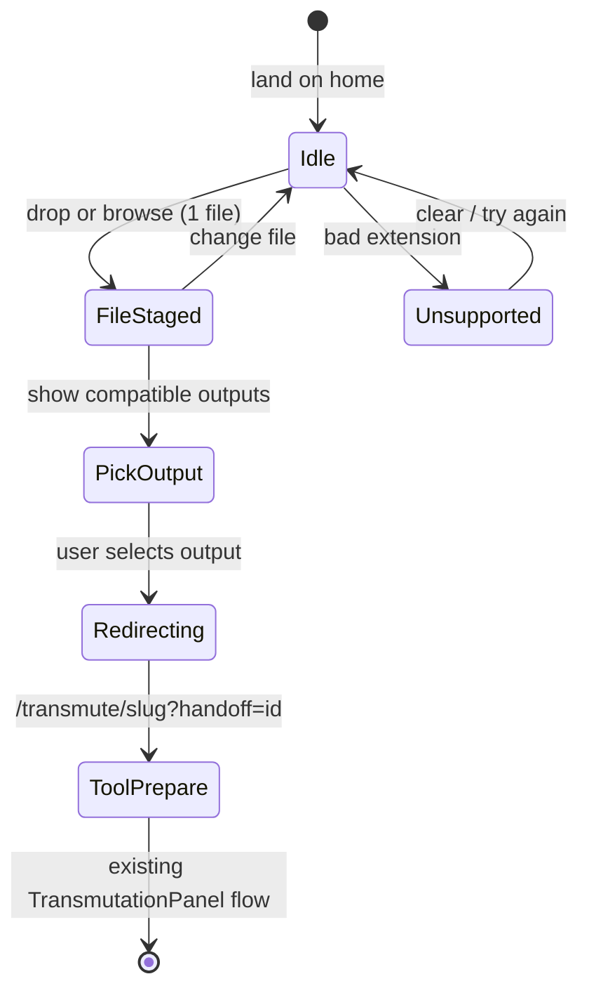

# Tier 3.5 — Universal Transmutator (v3.5.x)

> **Status:** **v3.5.0 shipped on `dev`** · **Target:** merge to `main` at tag `v3.5.0`  
> **Prerequisite:** Tier 3 complete (v3.0.1) — 21 active tools, 12 Wasm crates  
> **Inspired by:** Convertify “Universal Converter” — format-agnostic entry, route to existing tools  
> **Doctrine:** No new Wasm crate for MVP — **orchestration only** over `tool-registry.ts`

---

## 1. Product thesis

**Problem:** Users know they have “an image file” but not which Camaleon route (`/transmute/png-to-jpg`, etc.) matches their intent. The 21-tool matrix is powerful but requires format literacy.

**Solution:** **Universal Transmutator** — one home-page drop zone. User drops any **supported** input → UI lists **only real outbound tools** from the registry → user picks output → browser navigates to the existing transmutator with the file **already handed off**.

**Not in scope (MVP):** in-place conversion without navigation, multi-file batch, HEIC, new output formats, server upload.

---

## 2. Viability assessment

| Question | Answer |
|----------|--------|
| **Technically viable?** | **Yes.** Compatibility matrix is derivable from `getActiveTools()` (`fromFormat` + `acceptExtensions`). |
| **New engine work?** | **No** for v3.5.0 — reuse `TransmutationPanel` + prepare/transmute pipeline. |
| **Privacy preserved?** | **Yes** — file stays in browser; handoff is in-tab memory (see §5). |
| **Offline compatible?** | **Yes** after first visit — same as any tool route once redirected. |
| **Risk** | Medium — handoff + extension/format edge cases; mitigated by tests + reuse of `fileMatchesExtensions`. |

**Verdict:** Strong **Tier 3.5** capstone — product differentiator without reopening Tier 3 format milestones.

---

## 3. Compatibility model (source of truth)

### 3.1 Registry-driven graph

```text
User file extension
    → resolveInputFormat(fileName)     // normalize .jpg/.jpeg → JPEG family
    → findMatchingTools(file)          // filter active tools where acceptExtensions match
    → present outputs grouped by toFormat (JPG, PNG, WebP, AVIF, ICO, …)
    → user selects one ToolDefinition
    → navigate to /transmute/{slug}?handoff={id}
```

**Rule:** Never hardcode output lists. Always:

```typescript
getActiveTools().filter((t) => fileMatchesExtensions(file.name, t.acceptExtensions))
```

When registry gains a route (e.g. future HEIC→JPG), Universal automatically offers it.

### 3.2 Input formats today (21 tools → 10 input families)

| Input family | Extensions | Example outputs (from registry) |
|--------------|------------|----------------------------------|
| PNG | `.png` | JPG, WebP, AVIF, ICO |
| JPEG | `.jpg`, `.jpeg` | PNG, WebP, AVIF |
| WebP | `.webp` | PNG, JPG |
| GIF | `.gif` | PNG, JPG |
| BMP | `.bmp` | PNG, JPG |
| TIFF | `.tiff`, `.tif` | PNG, JPG |
| ICO | `.ico` | PNG |
| AVIF | `.avif` | PNG, JPG |
| SVG | `.svg`, `.svgz` | PNG, JPG |
| TGA | `.tga` | PNG |

**Note:** `fromFormat` uses both `JPG` and `JPEG` in registry — matching is **extension-based**, not enum-based.

### 3.3 Explicit non-goals

- No “convert to same format” (no PNG→PNG).
- No outputs we do not ship (SVG cannot → WebP until a tool exists).
- Unsupported extension (e.g. `.heic`) → friendly block + link to format list / future HEIC note.

---

## 4. UX placement & behaviour

### 4.1 Where it lives

**Primary: Home page (`/`), dedicated section — not a separate route for MVP.**

Recommended vertical order:

```text
┌─────────────────────────────────────────┐
│  Hero (title + tagline)                 │
├─────────────────────────────────────────┤
│  ★ Universal Transmutator (NEW)         │  ← only drop target on home
│    [ drop zone | browse button ]        │
│    → output picker (after file staged)  │
├─────────────────────────────────────────┤
│  Privacy banner                         │
├─────────────────────────────────────────┤
│  Available transmutations (ToolBrowser)   │  ← browse-first users unchanged
└─────────────────────────────────────────┘
```

**Why home, not `/transmute/universal`?**

- Matches Convertify mental model (“land → drop → choose”).
- Avoids an orphan route users must discover.
- Keeps **page-wide drag OFF** on home (unlike `/transmute/*` routes).

**Secondary entry points (v3.5.1+):**

- Command Palette: query “universal” → focus home section or open modal variant.
- Footer / nav link: `#universal-transmutator` anchor scroll.

### 4.2 Drop behaviour (isolated zone)

| Surface | Page-wide drag? | Rationale |
|---------|-----------------|-----------|
| `/` home | **No** — only `UniversalTransmutator` dropzone | User requirement; avoids accidental drops while scrolling |
| `/transmute/[slug]` | **Yes** (existing `usePageFileDrop`) | Power-user flow unchanged |

Implementation: **local** `onDragOver` / `onDrop` on the universal component (reuse `Dropzone` patterns), **do not** mount `usePageFileDrop` on home.

### 4.3 Interaction flow (states)



**State UI:**

1. **Idle** — dashed drop zone + “Browse file” button; supported formats hint (collapsible).
2. **FileStaged** — file name, size, detected format chip; “Change file”.
3. **PickOutput** — grid/list of outbound options (format pill, action title, lossy/lossless badge); sorted by `toFormat` then fidelity.
4. **Redirecting** — brief spinner while `router.push` (optional, usually instant).

### 4.4 Output picker design

- Group visually by **output format** (PNG, JPG, WebP, AVIF, ICO) — mirrors ToolBrowser families.
- Each row/card = existing tool copy (`resolveToolActionTitle`, description, fidelity badge).
- **Recommended** badge on most common web path (e.g. PNG→JPG “Compress for web”) — heuristic table in config, not hardcoded slugs in UI logic.
- Mobile: single column; desktop: 2-column grid inside the universal card.

---

## 5. File handoff architecture

**Constraint:** `File` objects cannot pass through URL. Same-tab SPA navigation only for MVP.

### 5.1 Handoff store (v3.5.0)

New module: `frontend/src/lib/transmutation/file-handoff.ts`

```typescript
// In-memory, tab-scoped, single-use tokens
stageFileHandoff(file: File): string   // returns uuid
consumeFileHandoff(id: string): File | null  // delete after read
```

- URL: `/transmute/png-to-jpg?handoff=<uuid>`
- `TransmutationPanel` on mount: read `searchParams.handoff`, `consumeFileHandoff`, if file → call existing `handleFileSelected` / prepare pipeline.
- **TTL:** entries expire after 60s if not consumed (prevent leaks on abandoned navigation).
- **Security:** uuid is unguessable; no network; no persistence across tabs.

### 5.2 TransmutationPanel integration

```typescript
// useEffect on mount + when tool changes
const handoffId = searchParams.get("handoff");
if (handoffId) {
  const file = consumeFileHandoff(handoffId);
  if (file && fileMatchesExtensions(file.name, tool.acceptExtensions)) {
    void startPrepare(file);
  } else {
    toast unsupported / mismatch
  }
  // strip ?handoff from URL via replaceState (clean share URL)
}
```

### 5.3 Future enhancement (v3.5.2 optional)

IndexedDB handoff for **new tab** / refresh survival — only if product demands it.

---

## 6. New code map

| File | Action |
|------|--------|
| `lib/tools/universal-matrix.ts` | `getToolsForFile(file)`, `getSupportedInputExtensions()`, format labels |
| `lib/transmutation/file-handoff.ts` | stage / consume / TTL |
| `lib/transmutation/file-handoff.test.ts` | unit tests |
| `components/transmute/UniversalTransmutator.tsx` | home section UI (states 1–3) |
| `components/transmute/UniversalOutputPicker.tsx` | output grid |
| `components/transmute/TransmutationPanel.tsx` | consume handoff on mount |
| `app/page.tsx` | insert `<UniversalTransmutator />` after Hero |
| `lib/i18n/dictionaries/en.ts`, `es.ts` | `landing.universal.*` |
| `docs/releases/v3.5.0.md` | release notes |
| `lib/releases/entries/v3.5.0.ts` | What's New |

**Reuse:** `Dropzone` styling tokens, `ToolRow`/`ToolCard` visual language, `fileMatchesExtensions`, `getActiveTools`.

---

## 7. Version plan (3.5.x)

| Version | Deliverable | Exit gate |
|---------|-------------|-----------|
| **v3.5.0** | Matrix lib + handoff + home `UniversalTransmutator` + redirect | Drop PNG → pick JPG → lands on `png-to-jpg` with file preparing |
| **v3.5.1** | i18n polish, `#universal` anchor, Command Palette entry, unsupported-format UX | EN/ES complete; palette finds universal |
| **v3.5.2** | Optional: “smart default” highlight, last-used output pref (localStorage), handoff metrics-free telemetry hook | UX refinement |

**SPEC / ROADMAP:** Add Tier 3.5 row — “Universal entry orchestration” (not a new Tier 4).

---

## 8. Edge cases & QA matrix

| Case | Expected |
|------|----------|
| `.png` drop | Offers JPG, WebP, AVIF, ICO routes |
| `.svg` drop | Only PNG, JPG (2 options) |
| `.ico` drop | Only PNG |
| `.heic` drop | Unsupported message; no redirect |
| Multi-file drop | First file only + optional toast “one file at a time” |
| Drop on home background | Ignored (no overlay) |
| Handoff expired | Tool page opens idle; toast “session expired, drop again” |
| Wrong tool handoff (tampered id) | Idle + toast |
| Offline after cache | Universal UI works; redirect to cached tool works |
| Risk mode / limits | Applied on destination tool (unchanged) |

---

## 9. Why this changes the game

| Before | After |
|--------|-------|
| User picks tool → then file | User picks file → then output |
| 21 routes to understand | 1 front door |
| Competes on matrix depth only | Matches Convertify **and** keeps deeper format coverage |

Camaleon retains advantage: **more outbound routes per input** once user is in the matrix (e.g. PNG→AVIF + ICO, not just JPG).

---

## 10. Open decisions (defaults recommended)

| Decision | Recommendation |
|----------|----------------|
| Separate `/convert` route? | **No** for v3.5.0 — home section only |
| Magic-byte sniff vs extension? | **Extension first** (v3.5.0); sniff in v3.5.2 if mislabelled files common |
| Auto-pick when only 1 output? | **Skip picker** — redirect immediately (e.g. ICO→PNG, TGA→PNG) |
| Hero redesign? | Keep hero text; universal block is visual hero **action** below tagline |

---

## 11. Implementation order (suggested)

1. `universal-matrix.ts` + tests (pure functions)
2. `file-handoff.ts` + tests
3. `TransmutationPanel` handoff consumer
4. `UniversalTransmutator` UI (idle → staged → picker)
5. Wire `page.tsx` + i18n
6. QA matrix §8 on `preview:cf`
7. Release v3.5.0 + What's New

---

*Planning doc — Universal Transmutator v3.5.x. Tier 3.5 orchestration layer; no new Wasm crate for MVP.*
