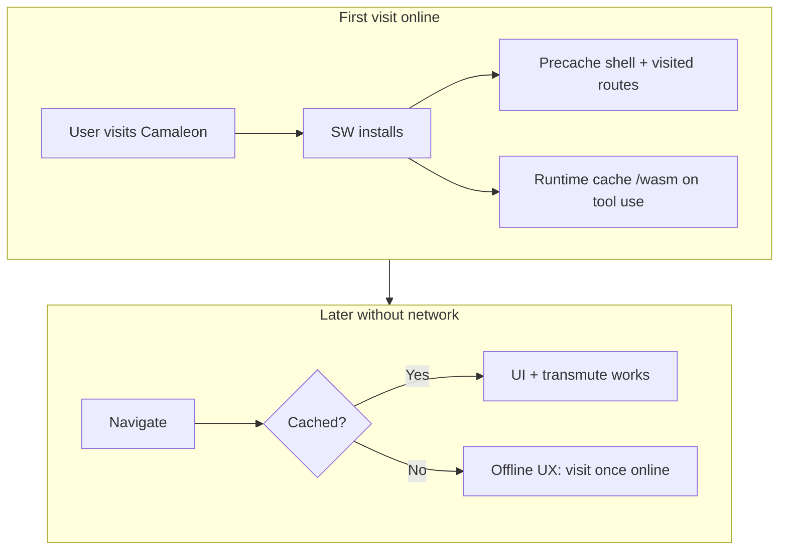

# Tier 3 — Modern Image Formats (AVIF first)

> **Branch:** `dev` (implementation) → merge to `main` at **v2.2.x**  
> **Status:** **v2.2.0 on `dev`** — Tier 3.2 complete (Phase 3.2.0–3.2.2); Tier 3.3 SVG analysis ✅  
> **Prerequisite:** Pre-Tier 3 UI/UX ✅ (v1.12.0) · Brand mark ✅ (v1.12.1) · Estimation engine perf ✅ (v1.12.2)  
> **Doctrine:** Same pipeline as Tiers 1–2 — decode → honest options → re-encode → StripAll → estimate-first  
> **SPEC anchor:** §1.3 Ladder B · §5.1 mental model · §12.4 Tier 3 · NFR-7 bundle · NFR-8 honesty · **`docs/LIMIT_PIPELINE.md`**

---

## 0. Tier 3 umbrella (what this milestone is)

Tier 3 is Camaleon's **first major app release line (v2.0.x)** after fifteen raster tools on v1.11+. It opens **Ladder B — modern image formats** (§1.3): codecs the web is adopting that legacy desktop tools often cannot open without conversion.

| Sub-phase | ID | Directions | Crate(s) | Target version | Status |
|-----------|-----|------------|----------|----------------|--------|
| **3.1** | AVIF decode | AVIF → PNG, AVIF → JPEG | `transmutador_avif` | **v2.1.1** | **3.1.0–3.1.2 ✅ shipped** |
| **3.2** | AVIF encode | PNG → AVIF, JPEG → AVIF | **`transmutador_avif_encode`** (+ decode in `transmutador_avif`) | **v2.2.0** | **3.2.0–3.2.2 ✅ shipped on `dev`** |
| **3.3** | SVG rasterize | SVG → PNG, SVG → JPEG | `transmutador_svg` (TBD) | v2.3.x | **Analysis ✅** — spike-gated (`resvg`); see `tier3_3_svg_analysis.md` |
| **3.4** | HEIC decode | HEIC → JPEG (→ PNG optional) | TBD | v2.x | Spike-gated (no pure-Rust decoder) |
| **3.5** | PWA / offline shell | App + tools work without network after first visit | Service Worker + web manifest (`@serwist/next`) | v2.x | **Last Tier 3 deliverable** — after 3.4.x |

**Normative:** Tier 3 remains **image transmutation only** — no PDF, no optimization sliders (Tier 4a), no crop/rotate (Tier 4b). See §12.5–12.7 SPEC. Phase **3.5** is delivery/UX infrastructure (not a new transmutator crate) but is **in scope** as the Tier 3 capstone.

**End state after 3.1:** **17 active tools** (15 + 2 AVIF outbound). **After 3.2.1:** **18 tools** (+ PNG→AVIF). **After 3.2.2:** **19 tools** (+ JPEG→AVIF). **End state after 3.5:** full modern-format tool matrix + **installable offline-capable PWA**.

---

## 1. Tier 3.1 scope summary

| Phase | Version (target) | Direction | Crate | Tools added |
|-------|------------------|-----------|-------|-------------|
| **3.1.0** | v2.0.0 | Spike | `transmutador_avif` (skeleton) | 0 | ✅ |
| **3.1.1** | v2.0.0 | AVIF → PNG | `transmutador_avif` | 1 | ✅ |
| **3.1.2** | v2.1.1 | AVIF → JPEG + preview UX | `transmutador_avif` | 1 | ✅ |
| **3.1.3** | v2.1.x | Tier 3.2 encode spike prep | — | — | ✅ |
| **3.2.0** | v2.2.x | AVIF encode spike (`ravif`) | `transmutador_avif_encode` | 0 | ✅ |
| **3.2.1** | v2.2.x | PNG → AVIF | `transmutador_avif_encode` | 1 | ✅ on `dev` |
| **3.2.2** | v2.2.x | JPEG → AVIF | `transmutador_avif_encode` | 1 | ✅ on `dev` |

**Out of Tier 3.1 MVP:**

- PNG/JPEG → AVIF encode (3.2 — slow Wasm encode; separate spike)
- Animated AVIF (`avis` sequence) frame picker — backlog 3.1.x or 3.2
- HDR / 10–12 bit preservation in PNG output — backlog; MVP = 8-bit SDR raster
- AVIF → WebP — no product demand; WebP suite is Tier 1 complete
- ICC / color-profile preservation — StripAll default (§5.10)
- Gain-map / HDR recovery — not v2.0.0

---

## 2. AVIF — format science (Tier 3 anchor)

### 2.1 What AVIF is

**AVIF (AV1 Image File Format)** is **not** a standalone pixel codec. It is a **constrained profile of HEIF** (High Efficiency Image File Format, ISO/IEC 23008-12): an **ISOBMFF** container (ISO Base Media File Format) that stores **AV1-coded** image items.

```
.avif bytes
  └── ISOBMFF boxes (ftyp, meta, mdat, …)
        ├── Item 'av01'  — primary coded image (AV1 bitstream)
        ├── Item aux     — alpha plane (separate AV1 item), depth, etc.
        └── meta         — EXIF, XMP, colr (ICC), clap, pasp
              └── AV1 decode → YUV planes → RGB/RGBA raster
```

| Layer | Role | Camaleon analogy |
|-------|------|------------------|
| **Container (HEIF)** | Item directory, metadata, brands (`avif`, `mif1`, `miaf`) | Like RIFF in WebP (`WEBP` + chunks) |
| **Codec (AV1)** | Intra prediction, transform, quantization, entropy coding | Like VP8/VP8L in WebP — next generation, better compression |
| **Profiles (MIAF)** | Restrict bit depth, tiles, layers for hardware interop | Decoder must accept common web profiles |

**Scientific properties (why the industry adopted it):**

| Property | Detail |
|----------|--------|
| **Compression efficiency** | Typically **30–50% smaller** than JPEG at similar visual quality (content- and encoder-dependent; not a guarantee per file) |
| **Lossy + lossless** | AV1 supports both; web delivery is mostly lossy; lossless AVIF exists for graphics |
| **Alpha** | Separate **auxiliary image item** (AV1-coded alpha), not JPEG-style impossibility |
| **Bit depth** | 8, 10, 12 bits per channel in spec; wide color gamut + HDR (PQ/HLG) in AVIF v1.2+ |
| **Tiled decode** | Large images split into tiles — affects memory/CPU, not user-visible options |
| **Sequences** | Brand `avis` — animated AVIF (multi-frame); MVP deferred |
| **Royalty-free** | AOMedia — adopted by browsers, CDNs, OS galleries |

**References:** [AVIF spec (AOMedia)](https://aomediacodec.github.io/av1-avif) · SPEC §12.4 table.

### 2.2 Why decode targets PNG and JPEG (not “any format”)

Camaleon's invariant pipeline (§5.1):

```
Input bytes → Decode to in-memory raster → Re-encode under target rules → Output bytes
```

PNG and JPEG are the **two poles** already used across all fifteen tools:

| Target | Encoding philosophy | User job |
|--------|---------------------|----------|
| **PNG** | Spatial, **lossless**, alpha allowed | Edit, composite, archive intermediate, open everywhere |
| **JPEG** | **Lossy**, no alpha, universal | Share, email, CMS without AVIF support |

AVIF → PNG/JPEG is the **same product decision** as WebP → PNG/JPEG (§5.12.2): convert a **modern delivery format** into **universal interchange** formats the user controls.

**We do not ship AVIF → WebP in 3.1** — WebP is Tier 1 complete; adding it duplicates ladder value without unlocking new user jobs.

### 2.3 What AVIF is for (user jobs)

| Use case | Why users transmute in Camaleon |
|----------|--------------------------------|
| **Browser/CDN asset → editor** | Received `.avif`; Photoshop / older tools need PNG |
| **Web → print / slide deck** | AVIF in email attachment; recipient needs JPEG |
| **Screenshot pipeline** | Some OSes save AVIF; user wants PNG for markup tools |
| **Privacy** | Convert locally — bytes never uploaded (P1) |
| **Alpha asset → JPEG share** | Logo on transparent AVIF → flattened JPEG for legacy upload |

### 2.4 What Camaleon will do in Tier 3.1 (MVP)

**Inbound only** — decode AVIF, re-encode to web-classic formats:

```
AVIF bytes
  → validate_input (byte cap)
  → inspect_avif_meta (dimensions, has_alpha, bit_depth, is_sequence) — BEFORE full decode
  → decode primary image item (+ merge alpha aux if present)
  → normalize to 8-bit RGB/RGBA (10/12-bit → 8-bit policy)
  → semantic_alpha assess (meaningful alpha for JPEG path)
  → StripAll on output
  → encode PNG (compression 1–9) OR JPEG (quality + background)
```

| Direction | Fidelity (`ToolDefinition`) | User-facing label |
|-----------|----------------------------|-------------------|
| **AVIF → PNG** | `lossless` | Lossless — pixels frozen post-decode; PNG compression affects bytes only |
| **AVIF → JPEG** | `lossy` | Lossy — new JPEG generation; alpha flattened |

### 2.5 Logic behind the transmutation

#### AVIF → PNG

1. **Parse container** — confirm `ftyp` brands include AVIF/MIAF-compatible set; locate primary `av01` item.
2. **Dimension probe** — read width/height from `ispe` / item properties **before** full AV1 decode; enforce `MAX_PIXELS` (40 MP, §5.7).
3. **Decode AV1** — tiles → YUV → RGB or RGBA (alpha item composited per libavif/zenavif rules).
4. **Bit-depth policy (MVP):** emit **8-bit** RGB/RGBA only. Sources with 10/12-bit → tone-map via decoder output to 8-bit (match chosen backend; document in honesty copy). **No 16-bit PNG** in v2.0.0.
5. **Semantic alpha** — `dynamic_image_has_meaningful_alpha` on full decode; PNG path preserves RGBA when meaningful.
6. **Encode PNG** — `PngEncoder::new_with_quality(CompressionType::Level(n), FilterType::Adaptive)`; same as `transmutador_webp`.
7. **Validate output** — magic bytes + non-empty (§5.11).

**Size expectation:** lossy AVIF → PNG often **+5×–25×** (entropy expansion, same class as §5.4.2 JPG→PNG and §5.12.4 WebP lossy→PNG). Lossless AVIF → PNG may be **±0–40%**.

#### AVIF → JPEG

1. Same decode + 8-bit normalization as above.
2. **Alpha:** if meaningful alpha → flatten with `BackgroundFill` (§5.5.2); reuse Semantic Alpha Engine (`assess_alpha` Wasm export).
3. **Encode JPEG** — quality 1–100, default 85; 4:2:0 via `image` `JpegEncoder` (§5.5.7 doctrine).
4. **Generational loss warning (NFR-8):**
   - Lossy AVIF → JPEG = **two lossy generations** (like WebP lossy → JPEG).
   - Lossless AVIF → JPEG = **first** lossy generation (acceptable if user chooses JPEG).

### 2.6 Variables modifiable **before** transmutation (UI / Wasm)

| Variable | AVIF → PNG | AVIF → JPEG | Notes |
|----------|------------|-------------|-------|
| **PNG compression** | ✅ (1–9) | — | Default **6**; pixels identical at all levels |
| **JPEG quality** | — | ✅ (1–100) | Default **85** |
| **Background color** | — | ✅ (if meaningful α) | `TransparencyNotice` + `BackgroundColorPill` |
| **Downscale preset** | ✅ | ✅ | If pixels > 40 MP — `AstroResizePanel` |
| **Oversize consent** | ✅ | ✅ | `LimitContext` |
| **Frame index** | ⏳ backlog | ⏳ backlog | When `is_sequence` true — mirror GIF `frameIndex` |

**Not user-modifiable (intrinsic to source file):**

- AV1 quantizer matrices, tile layout, chroma format of **source** bitstream (baked into decoded raster)
- Container EXIF/XMP/ICC (StripAll — not copied to output)
- HDR transfer function (decode produces display-referred 8-bit in MVP; may clip highlights — honesty copy)
- Lossy vs lossless mode of source AVIF (detected for messaging only; not a slider)

### 2.7 Properties altered (what changes irreversibly)

| Source property | AVIF → PNG | AVIF → JPEG |
|-----------------|------------|-------------|
| AV1 compression | Removed; DEFLATE PNG | Removed; DCT JPEG |
| Lossy AV1 artifacts | Frozen in pixels | Frozen + new JPEG artifacts |
| Alpha channel | Preserved if meaningful | Composited onto background |
| EXIF / XMP / ICC | **Stripped** (§5.10) | **Stripped** |
| 10/12-bit / HDR | → 8-bit SDR raster | → 8-bit SDR + lossy |
| File size | Usually **larger** (photos) | May shrink or grow vs AVIF |
| Animated sequence | MVP: first frame only (or reject sequence with i18n — **spike decides**) | Same |

**Non-identity law (§5.1):**

```
AVIF → PNG → AVIF  ≠  original AVIF
AVIF → JPEG → AVIF ≠  original AVIF
```

### 2.8 Size expectations (UI copy doctrine — NFR-8)

| Conversion | Typical Δ | Explanation |
|------------|-----------|-------------|
| Lossy AVIF → PNG | **+5×–25×** | Entropy expansion to lossless spatial storage |
| Lossless AVIF → PNG | **±0–40%** | Near-identical pixels; DEFLATE vs AV1 lossless efficiency |
| Lossy AVIF → JPEG Q≈85 | Variable | May be smaller than AVIF; **quality ≠ source** |
| Lossy AVIF → JPEG | Quality ↓ | Two lossy generations — always warn |

Proposed i18n keys (EN/ES): `tools.avifToPng.fidelityHint`, `tools.avifToJpg.fidelityHint` — draft in Phase 3.1.1/3.1.2.

### 2.9 Comparison to WebP (internal reference — Tier 1)

| Aspect | WebP (shipped) | AVIF (Tier 3.1) |
|--------|----------------|-----------------|
| Lossy codec | VP8 (JPEG-like blocks) | AV1 (more efficient, heavier CPU) |
| Container | RIFF | HEIF / ISOBMFF |
| Alpha | VP8X / lossless RGBA | Auxiliary AV1 item |
| Decode in ecosystem | `image` feature `webp` | **Not** default — dedicated backend required |
| Encode in ecosystem | `transmutador_encode` lossless WebP | `ravif` / `AvifEncoder` — Phase 3.2 |
| Camaleon pattern | `transmutador_webp` | **`transmutador_avif`** (mirror crate) |

---

## 3. Decode backend — technical decision (spike-gated)

### 3.1 SPEC correction

§12.4 lists `ravif` for decode — **`ravif` is encode-only** (rav1e wrapper). Decode requires a separate AV1 decoder + HEIF parser.

### 3.2 Candidate stacks

| Option | Decode | Wasm build | Est. bundle | Pure Rust | Recommendation |
|--------|--------|------------|-------------|-----------|----------------|
| **A — `zenavif`** | rav1d-safe + zenavif-parse | `wasm-pack` | TBD spike | ✅ | **Primary spike candidate** |
| **B — `image` + `avif-native`** | libdav1d (C) | `cc` + fragile on wasm32 | ~1–2 MB+ | ❌ | Fallback if A fails |
| **C — `libavif` + dav1d** | Industry reference | Emscripten glue | Large | ❌ | Avoid for modular worker |
| **D — Browser `createImageBitmap`** | Native | N/A | 0 | N/A | **Reject** — breaks Rust engine symmetry |

### 3.3 Spike decision rule (3.1.0)

Adopt backend **A** if all pass:

1. `wasm-pack build --target web --release` succeeds for `transmutador_avif` skeleton.
2. `.wasm` ≤ **3 MB** uncompressed (NFR-7); ≤ 4 MB absolute (§12.4 go/no-go).
3. Decodes fixture set (§3.4) with RGBA alpha case correct.
4. `inspect_avif_meta` reads dimensions **without** full tile decode (or documents cost if impossible).
5. `estimate_*` within **5%** of full encode on rgb8 fixture (CountingWriter parity).

Else escalate to **B** with Chief Architect amendment to SPEC §12.4.

### 3.4 Fixture matrix (3.1.0 spike)

Generate or source programmatically in `transmutador_avif/tests/spike_fixtures.rs`:

| Fixture | Probe | Decode | Notes |
|---------|-------|--------|-------|
| **rgb8_lossy** | ✅ | ✅ | Baseline photo-like |
| **rgba_alpha_aux** | ✅ | ✅ | Meaningful alpha → PNG RGBA |
| **opaque_rgba** | ✅ | ✅ | Structural alpha only — no false `TransparencyNotice` |
| **lossless** | ✅ | ✅ | Small graphic |
| **10bit** (if available) | ✅ | ✅ | Confirms 8-bit downshift policy |
| **animated_avis** | ✅ meta | ⏳ | Document `is_sequence`; MVP policy in §3.5 |
| **corrupt/truncated** | error | error | Honest `String` errors |
| **oversize_dims** | reject | — | `DimensionsTooLarge` before decode |

Document results in `docs/planning/tier3_1_avif_spike_results.md` (create after 3.1.0).

### 3.5 Open decisions (resolve in spike)

| # | Question | Default proposal | Resolve in |
|---|----------|------------------|------------|
| **Q1** | Animated AVIF in MVP? | **Reject with i18n** (`avifAnimatedNotSupported`) OR decode frame 0 only with scrubber backlog | 3.1.0 |
| **Q2** | 10/12-bit HDR output | **8-bit SDR** via decoder RGB8; honesty hint about highlight clipping | 3.1.0 |
| **Q3** | `image` crate in hot path? | **No** — keep `default-features = false`; decode via zenavif only | 3.1.0 |
| **Q4** | Alpha assess export | **`assess_alpha`** on `transmutador_avif` (mirror webp) | 3.1.2 |
| **Q5** | Alpha hint on estimate (v1.12.2) | **Yes** — pass `alpha_hint` to `estimate_avif_to_jpg_size` | 3.1.2 |

---

## 4. Wasm API contract (proposed — §6 stub before code)

Crate: `motor_transmutacion/transmutador_avif`  
Crate type: `["cdylib", "rlib"]`  
Dependencies: `core_utils`, decode backend (zenavif), `image` with `png`+`jpeg` features only for **encode** side.

```rust
// --- Meta / prepare (no full decode when possible) ---
inspect_avif_meta(bytes) -> AvifMeta {
    width, height, has_alpha_channel, bit_depth, is_sequence, frame_count
}

// --- Semantic alpha (prepare) ---
assess_alpha(bytes) -> AlphaAssessmentJs

// --- AVIF → PNG ---
transmutar_avif_a_png(bytes) -> Vec<u8>                    // compression default 6
transmutar_avif_a_png_with_compression(bytes, compression) -> Vec<u8>
estimate_avif_to_png_size(bytes, compression, alpha_hint: Option<AlphaAssessmentJs>) -> u32

// --- AVIF → JPEG ---
transmutar_avif_a_jpg(bytes) -> Vec<u8>                    // quality 85, white bg
transmutar_avif_a_jpg_with_quality(bytes, quality) -> Vec<u8>
transmutar_avif_a_jpg_with_options(bytes, quality, bg_r, bg_g, bg_b) -> Vec<u8>
estimate_avif_to_jpg_size(bytes, quality, bg_r, bg_g, bg_b, alpha_hint: Option<...>) -> u32
```

**Policies:**

- StripAll (§5.10) — HEIF `meta` EXIF/XMP/ICC not propagated.
- `validate_input` + extended `probe_dimensions` for AVIF magic/brands.
- `validate_output` — `OutputFormat::Png` | `Jpeg`.
- Post-encode integration tests for StripAll + IHDR color type + meaningful alpha JPEG path.

---

## 5. Shared engineering pattern (Tier 3.1 — mirror Wave 2)

1. Add `transmutador_avif` to workspace `Cargo.toml`.
2. `default-features = false` on all deps; minimal feature set.
3. `core_utils::validate_input` — extend dimension probe for AVIF ISOBMFF header path.
4. `estimate_*_size` via `CountingWriter` on every direction.
5. Worker: `initAvifWasm` lazy-load; `TransmutationModule` += `"transmutador_avif"`.
6. `frontend/src/types/wasm-modules.d.ts` — declare exports.
7. `build-wasm.mjs` / `.ps1` / `.sh` + `package.json` `build:wasm`.
8. `tool-registry.ts` — 2 entries; new `toolGroup: "modern"` (or `"avif"`).
9. `ImageFormat` type += `"AVIF"`; sniffer accepts `.avif`.
10. i18n EN + ES: `actionTitle`, `description`, `fidelityHint`, errors.
11. SPEC §5.13 AVIF Format Science + §6.6 `transmutador_avif` stub — **Architect updates before merge**.
12. Release `v2.0.0`: `lib/releases/entries/v2.0.0.ts`, `docs/releases/v2.0.0.md`, ROADMAP, package.json **2.0.0**.

---

## 6. Frontend integration (step-by-step)

### 6.1 Tool registry entries

```typescript
// avif-to-png — mirror webp-to-png
{
  id: "avif-to-png",
  slug: "avif-to-png",
  fromFormat: "AVIF",
  toFormat: "PNG",
  module: "transmutador_avif",
  category: "image",
  toolGroup: "modern",
  fidelity: "lossless",
  status: "soon", // → active when 3.1.1 ships
  acceptExtensions: [".avif"],
  outputExtension: "png",
  optionSpecs: [{ kind: "slider", key: "compression", min: 1, max: 9, ... }],
}

// avif-to-jpg — mirror webp-to-jpg
{
  id: "avif-to-jpg",
  fidelity: "lossy",
  optionSpecs: [quality slider, background color],
}
```

### 6.2 Prepare pipeline

1. Sniffer: magic / `ftyp` brand check for `.avif`.
2. `inspect_avif_meta` via worker prepare — width, height, `has_alpha_channel`, `is_sequence`.
3. If `is_sequence` — apply Q1 policy (reject or frame-0 only).
4. `assess_alpha` for `avif-to-jpg` — feed `PreparedFileContext.alphaAssessment`.
5. LimitContext: byte cap + 40 MP + astro downscale if needed.

### 6.3 Worker routing

```typescript
// transmutation.worker.ts (pattern)
transmutador_avif + purpose estimate + compression → estimate_avif_to_png_size
transmutador_avif + options.compression → transmutar_avif_a_png_with_compression
transmutador_avif + options.quality + background → transmutar_avif_a_jpg_with_options
```

### 6.4 UI surfaces

- `ToolPageHeader` — format chips AVIF → PNG / JPEG.
- `TransmutationPanel` — compression or quality + background pills.
- `TransparencyNotice` — auto via `optionSpecs` background (Semantic Alpha D5).
- `tool-groups.ts` — add `modern` group label i18n for landing / palette.

---

## 7. Phase checklist (disciplined serialization)

### 7.1 Phase 3.1.0 — AVIF spike (no user-facing tools)

**Goal:** Prove Wasm decode + size budget + fixture matrix.

- [x] Create `transmutador_avif` crate skeleton in workspace.
- [x] Wire decode backend (**zenavif 0.1.6** — Backend A).
- [x] Implement `inspect_avif_meta` + `decode_avif_to_dynamic` + `decode_avif_preview_png`.
- [x] `wasm-pack build --target web --release` — **1.81 MB** `.wasm` (see spike results).
- [x] Run fixture matrix (§3.4); documented in `tier3_1_avif_spike_results.md`.
- [x] Decide Q1–Q5 (§3.5) — animated reject; 8-bit SDR; zenavif-only decode.
- [ ] Extend `core_utils::probe_dimensions` for AVIF `ftyp` — **deferred to 3.1.1** (worker uses `inspect_avif_meta`).
- [ ] Chief Architect: draft SPEC §5.13 + §6.6 from this doc.

**Exit gate:** ✅ spike doc signed off; **Backend A** chosen.

### 7.2 Phase 3.1.1 — AVIF → PNG

**Goal:** First shippable Tier 3 tool.

- [x] `transmutar_avif_a_png_inner` + Wasm exports (default + compression).
- [x] `estimate_avif_to_png_size` (CountingWriter + alpha hint bytes).
- [x] Integration tests: valid path, empty, StripAll, RGBA alpha, estimate ≤5%, animated reject.
- [x] Worker lazy-load + estimate route (`transmutador_avif`).
- [x] `tool-registry` `avif-to-png` → `active`; `toolGroup: modern`.
- [x] i18n EN/ES + fidelity hint (size growth).
- [ ] Manual smoke: drop `.avif` → slider → download PNG.
- [ ] `npm run build:wasm` before deploy.

**Exit gate:** QA §8 items 1–7 pass (manual smoke pending).

### 7.3 Phase 3.1.2 — AVIF → JPEG

**Goal:** Complete outbound AVIF pair.

- [x] `assess_alpha` Wasm export (semantic alpha).
- [x] `transmutar_avif_a_jpg_*` + flatten policy (§5.5.2).
- [x] `estimate_avif_to_jpg_size` + `alpha_hint` param (v1.12.2 pattern).
- [x] Integration tests: opaque, meaningful alpha + white/black bg, quality range, estimate drift.
- [x] `avif-to-jpg` registry + i18n (warn lossy-on-lossy).
- [x] Animated preview UX: frame-preview worker, session cache, scrub overlay split (v2.1.1 hotfix).

**Exit gate:** QA §8 all items + alpha engine parity with WebP→JPG.

### 7.4 Phase 3.1.3 — Release v2.0.0 (Tier 3.1 partial — AVIF→PNG)

- [x] `frontend/package.json` → `2.0.0`; engine workspace → `1.5.0`
- [x] `docs/releases/v2.0.0.md` + What's New manifest + i18n `v200` entry
- [x] SPEC amendment log + ROADMAP Tier 3.1 shipped row
- [x] `docs/LIMIT_PIPELINE.md` regression reference
- [ ] `npm run build:wasm` clean CI build before deploy
- [x] Merge `dev` → `main` + tag `v2.0.0`

**Note:** Full Tier 3.1 pair (AVIF→JPEG) ships after Phase 3.1.2; v2.0.0 is the **major baseline** for the v2.x line.

### 7.5 Phase 3.2.0 — AVIF encode spike

**Goal:** Prove `ravif` Wasm encode, speed/quality policy, and NFR-7 budget — **no user-facing tools yet**.

- [x] Create `transmutador_avif_encode` crate (`ravif` 0.13, `default-features = false`).
- [x] `transmutar_png_a_avif_*` + `transmutar_jpg_a_avif_*` Wasm exports (quality + speed).
- [x] Semantic alpha on PNG path; `OutputFormat::Avif` in `core_utils`.
- [x] Round-trip tests: encode → `transmutador_avif` zenavif decode.
- [x] Wasm size: encode **1.67 MB**, decode **1.90 MB** (merged **3.45 MB** — split adopted).
- [x] `build-wasm.mjs` includes `transmutador_avif_encode`.
- [x] Document in `docs/planning/tier3_2_avif_encode_spike_results.md`.

**Exit gate:** ✅ spike doc signed off; **ravif + split crate** chosen. Defaults: quality **60**, speed **6**.

**Locked for 3.2.1+:**

| Direction | Fidelity | Sliders |
|-----------|----------|---------|
| PNG → AVIF | `lossy` | quality 1–100, speed 1–10 |
| JPEG → AVIF | `lossy` | quality 1–100, speed 1–10 + generational loss hint |

### 7.6 Phase 3.2.1 — PNG → AVIF

**Goal:** First inbound AVIF encode tool (18th active conversion).

- [x] `estimate_png_to_avif_size` (full encode parity).
- [x] Worker lazy-load + transmute/estimate routes (`transmutador_avif_encode`).
- [x] `tool-registry` `png-to-avif` → `active`; `toolGroup: modern`.
- [x] i18n EN/ES + quality + speed sliders + fidelity hint.
- [x] `wasm-modules.d.ts` + `build-wasm.mjs` + post-resize route for AVIF output.
- [ ] Manual smoke: drop `.png` → sliders → transmute → download `.avif`.
- [ ] `npm run build:wasm` before deploy.

**Exit gate:** QA §8 items 1–7 for PNG→AVIF path (manual smoke pending).

### 7.7 Phase 3.2.2 — JPEG → AVIF

**Goal:** Complete inbound AVIF pair (19th active conversion).

- [x] `estimate_jpg_to_avif_size` (full encode parity).
- [x] Worker `encodeSource: jpeg` routing on `transmutador_avif_encode`.
- [x] `tool-registry` `jpg-to-avif` → `active`.
- [x] i18n EN/ES + generational loss hint (NFR-8).
- [ ] Manual smoke: drop `.jpg` → transmute → download `.avif`.
- [ ] `npm run build:wasm` before deploy.

**Exit gate:** Tier 3.2 inbound pair complete — manual smoke pending.

### 7.8 Phase 3.2.3 — Release v2.2.0 (Tier 3.2 complete)

- [x] `frontend/package.json` → `2.2.0`; engine workspace → `1.6.0`
- [x] `docs/releases/v2.2.0.md` + What's New manifest + i18n `v220` entry
- [x] SPEC §6.11 + amendment log + ROADMAP + README
- [x] `docs/planning/tier3_3_svg_analysis.md` (planning only — no SVG tools in v2.2.0)
- [ ] `npm run build:wasm` clean CI build before deploy
- [ ] Push `dev` → merge `main` → tag `v2.2.0`

---

## 8. QA gate (per phase — same bar as Wave 2 §6)

1. `cargo test -p transmutador_avif`
2. `cd frontend && npm run build:wasm && npx tsc --noEmit && npm run build`
3. Manual smoke: drop → options → transmute → download
4. Estimate tracks compression / quality slider changes
5. i18n EN + ES complete for tool + errors
6. Wasm module ≤ **3 MB** uncompressed
7. StripAll integration test on both directions
8. LimitContext: 40 MP block + astro downscale on huge AVIF
9. NFR-8: fidelity hints accurate — no false "lossless" on JPEG path

---

## 9. Recommended execution order

```
3.1.0   AVIF spike (backend + fixtures + wasm size + spike_results.md)
3.1.1   AVIF → PNG
3.1.2   AVIF → JPEG
3.1.3   Release v2.0.0 (Tier 3.1 complete)
─────── future ───────
3.2.0   AVIF encode spike (ravif, speed/quality, bundle budget)
3.2.1   PNG → AVIF
3.2.2   JPEG → AVIF
3.3.x   SVG → PNG/JPEG (resvg spike)
3.4.x   HEIC → JPEG (honest defer if spike fails)
3.5.x   PWA / offline shell — **last Tier 3 item** (§13)
```

**Rationale:** AVIF **decode-only** first — highest user demand (files they cannot open), reuses PNG/JPEG encoders we trust. Encode is CPU-heavy in Wasm; honest UX requires separate spike. SVG/HEIC follow same spike-first doctrine as SPEC §12.4. **PWA/offline is deferred to 3.5.x** so the Wasm cache budget and tool registry are stable (all Tier 3 crates shipped) before precache/runtime-cache policy is finalized.

---

## 10. Risk matrix (Tier 3.1)

| Risk | Impact | Mitigation |
|------|--------|------------|
| **Wasm bundle > 3 MB** | Blocks merge (NFR-7) | Minimal deps; decode-only; no rav1e encoder in 3.1 |
| **Decode latency on 40 MP** | UI freeze perception | Worker isolation (P3); coalescing; estimate cache (v1.12.2) |
| **zenavif immaturity** | Decode bugs | Fixture matrix; pixel compare vs libavif in native tests only |
| **HDR clipping** | User trust | Honesty hint; no "HDR preserved" claim |
| **Animated AVIF** | Scope creep | Q1: reject or frame 0; scrubber in 3.1.x backlog |
| **Dual alpha models** | False transparency UI | Semantic Alpha Engine — meaningful only (§5.5.3) |
| **C decoder fallback (dav1d)** | Build fragility | Spike B only if A fails; document in SPEC |
| **Generational loss confusion** | Support burden | NFR-8 copy for AVIF→JPG |

---

## 11. Cross-cutting requirements (§12.8 checklist)

| # | Requirement | Tier 3.1 owner phase |
|---|-------------|----------------------|
| 1 | ToolRegistry `soon` → `active` | 3.1.1 / 3.1.2 |
| 2 | Worker lazy-load | 3.1.1 |
| 3 | `TransmutationModule` type | 3.1.1 |
| 4 | `wasm-modules.d.ts` | 3.1.1 |
| 5 | Build scripts | 3.1.1 |
| 6 | `estimate_*_size` | 3.1.1 / 3.1.2 |
| 7 | i18n EN/ES | 3.1.1 / 3.1.2 |
| 8 | SPEC §6 stub | 3.1.0 (Architect) |
| 9 | ROADMAP update | 3.1.3 |
| 10 | PWA manifest + Service Worker | **3.5.x** (Tier 3 capstone) |
| 11 | Offline UX + i18n | **3.5.x** |
| 12 | Optional NFR-9 offline shell | **3.5 ship** (Architect) |

---

## 12. Tier 3.3 SVG — analysis pointer

Full format science, parameter model, security, spike gates, and phase checklist: **`docs/planning/tier3_3_svg_analysis.md`**.

**One-line doctrine:** SVG is a **vector scene**, not a pixel codec; Camaleon **rasterizes** at user-chosen dimensions, then reuses the PNG/JPEG encoders. Implementation starts with **3.3.0 spike** only after Chief Architect go/no-go.

**Backlog (user-requested, not blocking 3.3):** friendly UX warnings when **AVIF encode** (or SVG rasterize at huge output size) may take several minutes on large inputs — same honesty class as NFR-8.

---

## 13. Related documents

| Doc | Role |
|-----|------|
| `docs/SPEC.md` §5.1, §5.12 (WebP template), §12.4 | Normative architecture |
| `docs/ROADMAP.md` Tier 3 row | Milestone tracking |
| `docs/planning/tier2_wave2_plan.md` | Phased delivery pattern reference |
| `docs/planning/semantic_alpha_engine_plan.md` | Alpha honesty for AVIF→JPEG |
| `docs/planning/tier3_1_avif_spike_results.md` | ✅ Phase 3.1.0 spike results |
| `docs/LIMIT_PIPELINE.md` | **Regression reference** — byte zones, astro, AVIF, session limits |
| `docs/releases/v2.0.0.md` | **Shipped v2.0.0** (Phase 3.1.0–3.1.1) |
| `docs/releases/v2.1.1.md` | **Shipped v2.1.1** (Phase 3.1.2 + preview UX) |
| `docs/planning/tier3_2_avif_encode_spike_results.md` | ✅ Phase 3.2.0 encode spike |
| `docs/planning/tier3_3_svg_analysis.md` | ✅ Phase 3.3 format science & plan (pre-spike) |
| `docs/ROADMAP.md` backlog row | PWA / offline shell — owner phase **3.5.x** |
| `motor_transmutacion/transmutador_webp/` | Closest implementation mirror |

---

## 14. Phase 3.5 — PWA / offline shell (Tier 3 capstone)

> **Schedule:** Implement **after Phase 3.4.x** (HEIC). This is the **last deliverable of Tier 3** — no format work ships after 3.5 until Tier 4.
>
> **Product thesis:** Transmutation is already 100% client-side (NFR-1). Offline capability closes the gap: users should convert images **without internet** once the app shell and Wasm modules are cached — reinforcing privacy and local processing as the core promise.

### 13.1 Viability summary

| Question | Answer |
|----------|--------|
| Is it technically feasible? | **Yes** — PWA + Service Worker; no Rust/engine rewrite |
| Works with zero prior network? | **No** — at least one online visit (or PWA install while online) required |
| Works offline after first visit? | **Yes** — for cached routes and Wasm modules |
| Aligns with Camaleon? | **Strongly** — extends “files never leave this tab” to “app works without connectivity” |
| Blocks Tier 3 format work? | **No** — intentionally **last** so final crate count and `public/wasm/` size are known |

### 13.2 What is already offline-ready (no new engine work)

```
User → File API (local)
     → Web Workers (transmutation.worker.ts, frame-preview.worker.ts)
     → dynamic import /wasm/{crate}/{crate}.js  (load-glue.ts)
     → Wasm in memory
     → Blob download
```

| Property | Today |
|----------|-------|
| File bytes on network | **Never** (NFR-1) |
| Analytics / third-party trackers | **None** in app code |
| Locale / theme | `localStorage` + `PREFERENCES_BOOTSTRAP_SCRIPT` |
| Wasm loading | Lazy per tool via `importWasmGlue` |
| Tool routes | `generateStaticParams` on `/transmute/[slug]` |

**Gap:** HTML, JS chunks, workers, and `/wasm/*` assets are fetched from Cloudflare (OpenNext) on each cold start — **no Service Worker** today.

### 13.3 What still requires network (without 3.5)

| Resource | Source | Offline without SW |
|----------|--------|------------------|
| HTML (/, `/transmute/*`, legal pages) | Cloudflare Worker (OpenNext) | ❌ |
| Next.js JS/CSS chunks | `.open-next/assets` | ❌ |
| Module workers | Bundled by Next | ❌ |
| Wasm (`/wasm/transmutador_*`) | `public/wasm/` static | ❌ until loaded once |
| Fonts (Geist) | `next/font` — self-hosted at build | ✅ if cached by SW |
| External links (GitHub, etc.) | Navigation | ⚠️ graceful fail |

### 13.4 Cache budget (NFR-7 aware)

| Layer | Approx. size | Offline role |
|-------|--------------|--------------|
| App shell (JS + CSS + workers + fonts + icons) | ~2–5 MB | **Precache** (required) |
| All Wasm crates (`public/wasm/`, lazy today) | ≤ **12 MB** aggregate (NFR-7) | **Runtime cache** or optional full precache |
| **Full offline toolkit** | ~10–17 MB total | After 3.4.x — includes any new 3.2–3.4 crates |

**Policy:** Default = **do not** precache all Wasm on mobile (storage quotas). Desktop / power users may opt into “download full toolkit” (§13.6 model C).

### 13.5 Architecture — three cache layers

```
Layer 1 — App shell (precache on SW install)
  /, /transmute/*, JS chunks, CSS, workers, manifest, icons, fonts

Layer 2 — Wasm on demand (runtime cache, CacheFirst for /wasm/**)
  First online use → fetch + store
  Offline → same tool works if module was cached

Layer 3 — Full toolkit (optional user action)
  Precache all transmutador_* crates after Tier 3.4 tool matrix is final
```



### 13.6 Product models (target: B as default)

| Model | Experience | Effort | Tier 3.5 target |
|-------|------------|--------|-----------------|
| **A — Partial offline** | Only routes/tools already visited | Low | **3.5.0 MVP** |
| **B — Shell + lazy Wasm** | App opens offline; tools work after one online use each | Medium | **3.5.1 default** |
| **C — Full toolkit download** | All Tier 3 tools offline after explicit download | Medium+ | **3.5.2 optional** |

### 13.7 Technical strategy (Next 15 + Cloudflare)

**Recommended stack:** `@serwist/next` (App Router successor to `next-pwa`).

| Step | Work |
|------|------|
| 1 | `manifest.webmanifest` — `name`, icons, `display: standalone`, `theme_color` |
| 2 | Service Worker — precache shell; `CacheFirst` for `/wasm/**` and hashed assets |
| 3 | Register SW **production only** (not `next dev`) |
| 4 | Offline UX — connection banner, uncached-route message (i18n EN/ES) |
| 5 | Update flow — “New version available” aligned with Release Comms |
| 6 | SPEC amendment — optional **NFR-9** offline shell (Architect at 3.5 ship) |

**Cloudflare / OpenNext:** No migration to static export required. SW caches browser-side; CDN and SW are complementary. Deploy path unchanged: `npm run build:wasm` → `opennextjs-cloudflare build` → `deploy`.

**SSR hardening (3.5.1):** `layout.tsx` and tool pages use `cookies()` for locale/metadata — may force dynamic HTML. Medium-term: treat `localStorage` bootstrap as source of truth; static HTML per route improves precache predictability. Not a blocker for 3.5.0 (SW caches responses from visited sessions).

### 13.8 UX requirements (honesty)

| Surface | Copy / behavior |
|---------|-----------------|
| Offline indicator | “No connection — Camaleon works with what’s already downloaded” |
| Uncached tool route | “This tool needs one online visit before offline use” |
| Install prompt | “Add to home screen” where `beforeinstallprompt` applies |
| Version update | Toast + reload when new SW activates (reuse Release Comms patterns) |
| Privacy alignment | Offline reinforces `/privacy` — no upload, no trackers |

### 13.9 Risks and mitigations

| Risk | Mitigation |
|------|------------|
| iOS Safari storage quotas | No full Wasm precache by default; encourage installed PWA |
| Stale SW after deploy | `skipWaiting` + user-facing reload prompt |
| Tier 3.2–3.4 grow Wasm budget | Finalize cache policy in **3.5** after all crates ship |
| Cold start with zero cache | Honest landing message — first visit requires network |
| QA matrix | online → offline → transmute → reload → SW update |

### 13.10 Phase checklist (3.5.x)

#### 3.5.0 — PWA MVP (partial offline)

- [ ] `manifest.webmanifest` + icons (192/512)
- [ ] `@serwist/next` integration; SW precache app shell
- [ ] Runtime cache rule for `/wasm/**` (CacheFirst)
- [ ] Offline banner + basic i18n EN/ES
- [ ] Manual QA: visit tool online → airplane mode → transmute succeeds
- [ ] `docs/releases/v2.x.x.md` + What's New entry at ship version

**Exit gate:** Home + one visited `/transmute/*` route work offline; transmute + download succeed.

#### 3.5.1 — Shell hardening + lazy Wasm default

- [ ] Precache all active `/transmute/[slug]` static params (full tool route list post-3.4)
- [ ] Cache `transmutation.worker.ts` + `frame-preview.worker.ts` reliably
- [ ] Reduce `cookies()`-driven dynamic HTML where safe (static route optimization)
- [ ] Uncached-route offline page component
- [ ] SW update UX integrated with release version bump

**Exit gate:** App shell opens offline; any tool used once online works offline thereafter.

#### 3.5.2 — Full toolkit download (optional)

- [ ] Settings or first-run CTA: “Download all tools for offline use”
- [ ] Precache entire `public/wasm/` (post-3.4 crate list)
- [ ] Progress UI + storage failure handling
- [ ] Desktop-first; hidden or warned on constrained mobile

**Exit gate:** User can convert with any active Tier 3 tool offline without prior per-tool visit.

### 13.11 QA gate (additions for 3.5)

1. All §8 gates still pass for format phases
2. `npm run build` with Serwist enabled — no SW in dev
3. Lighthouse PWA audit — installable + offline start (visited shell)
4. Chrome + Safari (desktop + iOS installed PWA smoke)
5. Verify **no file bytes** leave device when offline (NFR-1 regression)
6. Post-deploy: old SW → new version prompt within one session

### 13.12 Out of scope for 3.5

| Item | Why |
|------|-----|
| Native desktop app (Tauri/Electron) | Different product line |
| Background sync / queue uploads | No server upload model |
| Offline **first** install without network | Browser limitation — honest UX only |
| Tier 4 features (compress, crop) | Separate milestone |

---

*Planning doc for Tier 3 — Modern Image Formats. Tier 3.2.0 encode spike complete on `dev`; next: **3.2.1 PNG → AVIF**. Tier 3 closes with Phase 3.5.x PWA/offline after 3.4.x.*
