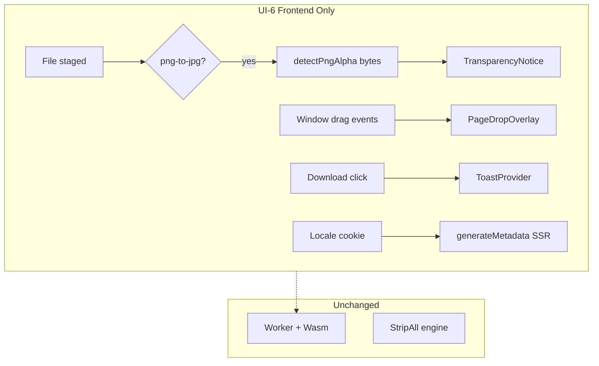

# UI-6 — UX Polish Layer (Post-v1.0.0)

> **Author:** Chief Architect (Cursor)  
> **Date:** 2026-06-04  
> **Status:** Planned — ready for OpenCode execution  
> **Target release:** Frontend **v1.1.0** (engine stays **v1.0.0** — no Wasm changes)

---

## 1. Context

MVP **v1.0.0** is complete (functional JPEG ↔ PNG, UI-1..UI-5, CI, engine hardening). The next intentional layer is **§2 Mejorar la UI/UX** from the post-MVP roadmap discussion — **not** new formats (point 3: WebP, batch, etc.).

This plan scopes **UI-6**: frontend-only UX improvements that increase clarity, discoverability, and shareability without changing the transmutation pipeline or privacy model (NFR-1).

| Source item | Priority (original) | UI-6 scope |
|-------------|---------------------|------------|
| UI-5 a11y baseline | Alta | ✅ Done (v1.0.0) — no repeat work |
| Transparency pre-notice (PNG→JPG) | Alta | **R1 — In scope** |
| ToolCard affordance without hover | Media | ✅ Done (UI-5) |
| `generateMetadata` per locale | Media | **R4 — In scope (cookie bridge, not URL routing)** |
| Full-page drag-over | Baja | **R2 — In scope (tool pages only)** |
| Toasts / richer post-action feedback | Baja | **R3 — In scope** |

**Explicitly out of scope for UI-6:**

- `[locale]` URL segments / middleware i18n routing (ROADMAP P4 — future **v1.2+**)
- WebP, batch, chroma subsampling UI, PWA (point 3 / ROADMAP P3, P5, P7)
- Rust/Wasm, Worker protocol, Playwright E2E (v1.1.0 engineering track — separate prompt)
- Landing-page drop → auto-navigate to tool (confusing routing; defer)

---

## 2. Feasibility Summary

| Deliverable | Viability | Risk | Backend change |
|-------------|-----------|------|----------------|
| PNG alpha detection + notice | **High** | False negatives on exotic PNGs — mitigated by chunk scan + color type | None |
| Full-page drop overlay | **High** | Event bubbling vs inner dropzone — use capture + overlay z-index | None |
| Toast feedback | **High** | Over-toasting — limit to download + optional success | None |
| Locale metadata (SSR) | **Medium** | First visit SSR uses default locale until cookie set — acceptable | None |

**Overall verdict:** All four items are implementable in a **single OpenCode pass** (~1 frontend session). No blockers. Estimated diff: ~8–12 files, no new npm dependencies.

---

## 3. Technical Approach

### 3.1 R1 — Transparency pre-notice (PNG→JPG)

**Problem:** SPEC §5.11.2 flags “silent alpha loss without notice” as a UX gap. Users flatten transparency without understanding why edges look wrong.

**Solution:**

1. Add `frontend/src/lib/format/detect-png-alpha.ts`:
   - Parse PNG signature + IHDR **color type** (types `4` grayscale+alpha, `6` RGBA → alpha present).
   - Scan subsequent chunks (bounded, e.g. first 64 KB) for `tRNS` on types `0`, `2`, `3`.
   - Return `{ hasAlpha: boolean; reason: 'rgba' | 'trns' | 'none' }`.
   - Pure TypeScript on `ArrayBuffer` — no Canvas decode (keeps memory low on large files).

2. On file stage in `TransmutationPanel` when `tool.id === 'png-to-jpg'`:
   - Run detector async after `arrayBuffer()` read.
   - If `hasAlpha`, show `TransparencyNotice` banner (token `--info` / `--warning` styling) **above** `OptionsControls`.
   - Copy must reference **current background color** from options (updates live when user changes swatch).
   - i18n keys: `panel.transparencyNotice.title`, `.body` with `{color}` placeholder (human-readable color name or hex).

3. **Do not block** transmutation — informational only (matches SPEC “recommended notice”, not hard gate).

### 3.2 R2 — Full-page drag overlay

**Problem:** Drop target is a small dashed box; power users expect dropping anywhere on the tool workspace.

**Solution:**

1. `PageDropOverlay` component: fixed inset overlay, `pointer-events-none` when hidden; when `draggingFile` true → visible accent border + backdrop, `pointer-events-auto`.
2. Hook in `TransmutationPanel` (or thin `usePageFileDrop` hook):
   - Listen `window` `dragenter` / `dragleave` / `dragover` / `drop` only when `status === 'idle' | 'staged'` and not `processing`.
   - Use drag counter pattern to avoid flicker on child elements.
   - Filter `dataTransfer.types` includes `'Files'`.
   - On drop: same validation as inner dropzone (`fileMatchesExtensions`).
3. **Scope:** `/transmute/[slug]` only — not landing `/` (avoids ambiguous routing).

### 3.3 R3 — Toast system

**Problem:** Download and success states are visually clear but easy to miss; no ephemeral confirmation.

**Solution:**

1. Minimal stack — no external library:
   - `components/ui/Toast.tsx` — token-driven, `role="status"`, `aria-live="polite"`.
   - `providers/ToastProvider.tsx` — context + `toast({ message, variant })`, auto-dismiss ~4s, respects `prefers-reduced-motion`.
2. Mount provider in `layout.tsx` inside `I18nProvider` (toasts use `t()`).
3. Trigger points:
   - After successful `downloadResult()` → `toast.success(t('toast.downloadStarted'))`.
   - Optional: on transition to `success` status → `toast.success(t('toast.transmutationComplete'))` — **one toast max per action** (do not stack both if redundant; prefer download toast only OR success on transmute complete before download — document choice in report).

### 3.4 R4 — Locale-aware metadata (without URL routing)

**Problem:** `generateMetadata` is English-only static strings; UI is bilingual via client `localStorage`.

**Solution (cookie bridge — pragmatic v1.1.0):**

1. `lib/i18n/metadata.ts` — server-safe helpers:
   - `getPageMetadata(locale, pageKey, params?)` → `{ title, description, openGraph }`.
   - Reuse copy from dictionaries where possible (import EN/ES meta blocks) — **do not duplicate long prose**; extend `dictionaries/*.ts` `meta` sections for tool pages if needed.

2. Sync locale to cookie in `I18nProvider.setLocale`:
   - `document.cookie = 'camaleon-locale=es; path=/; max-age=31536000; SameSite=Lax'`.
   - Mirror in inline layout script on hydration (read localStorage → set cookie) so next navigation gets correct SSR metadata.

3. Update metadata exports:
   - `app/layout.tsx` → `generateMetadata()` reads `cookies().get('camaleon-locale')`, fallback `DEFAULT_LOCALE`.
   - `app/transmute/[slug]/page.tsx` → localized title/description per tool.

4. Add basic OpenGraph: `title`, `description`, `type: 'website'`, `locale` (`en_US` / `es_ES`).

**Deferred:** Full `[locale]` App Router segments (requires route restructure, hreflang, sitemap) — document as **UI-7 / v1.2**.

---

## 4. Architecture Diagram

---

## 5. OpenCode Execution Plan

| Step | Action | Verification |
|------|--------|--------------|
| 1 | Read SPEC §5.5.2, §5.11.2, §7.5–§7.8 | — |
| 2 | Implement R1 alpha detector + notice | Manual: transparent PNG shows banner; opaque PNG does not |
| 3 | Implement R2 page overlay | Manual: drop file anywhere on tool page |
| 4 | Implement R3 toasts | Manual: download shows toast; a11y live region |
| 5 | Implement R4 metadata + cookie sync | View page source / tab title after locale switch + refresh |
| 6 | i18n EN+ES for all new strings | Both locales complete |
| 7 | Bump frontend to **v1.1.0**; amend SPEC §7.5/§7.8 (UI-6 ✅) | `npm run build` |
| 8 | Report `docs/reports/ui_6_ux_polish_layer_done.md` | Architect review |

**Prompt file:** `docs/prompts/ui_6_ux_polish_layer.md`

---

## 6. Acceptance Criteria (Architect validation)

- [ ] Transparent PNG staged on PNG→JPG shows localized notice with current background color.
- [ ] Opaque PNG / JPG tools do not show false-positive notice.
- [ ] File can be dropped anywhere on tool page (idle/staged); overlay hidden during processing.
- [ ] Toast appears on download; dismisses automatically; reduced-motion respected.
- [ ] After switching locale and refreshing, `<title>` and meta description match selected language.
- [ ] No Rust/Wasm/Worker changes; NFR-1 preserved.
- [ ] `npm run build` passes; UI-5 a11y not regressed.

---

## 7. Version & Roadmap Notes (post-validation)

| Artifact | Bump |
|----------|------|
| `frontend/package.json` | 1.0.0 → **1.1.0** |
| `Footer.tsx` | match |
| `motor_transmutacion` | **unchanged** (1.0.0) |
| `docs/SPEC.md` | PATCH/MINOR doc — UI-6 track row |

Chief Architect updates `docs/ROADMAP.md` after OpenCode delivery (OpenCode must **not** edit ROADMAP).

---

## 8. What Comes After UI-6

| Track | Contents |
|-------|----------|
| **Engine v1.1.0** (separate prompt) | Playwright E2E, `refine_jpeg_encoder_swap` |
| **Point 3 — Features** | WebP crate, batch queue |
| **UI-7** | `[locale]` routing, landing drag-to-tool, richer success panel |
