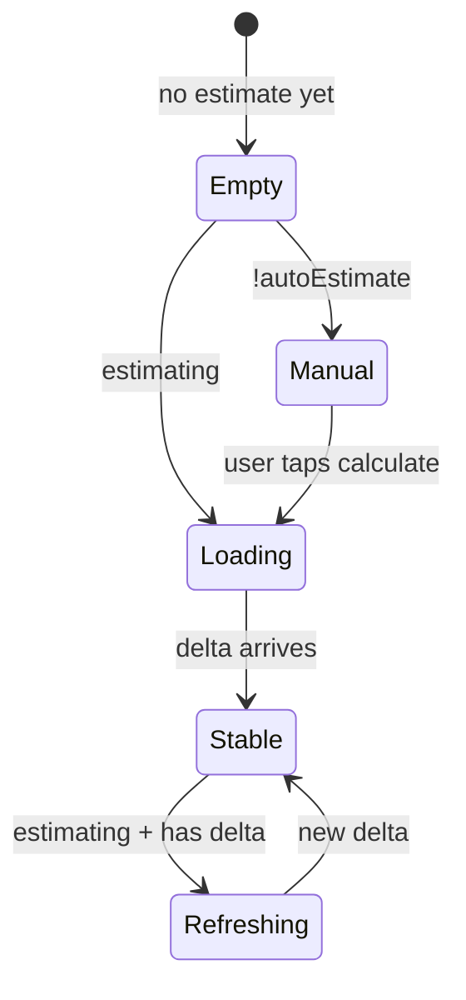

# v1.5.0 — Phase C Result Cache + Centralized Metrics UX Animation

> **Author:** Chief Architect (Cursor)  
> **Date:** 2026-06-06  
> **Status:** Planned — ready for OpenCode execution  
> **Target release:** Frontend **v1.5.0** (engine stays **v1.2.0** — no Rust changes)  
> **Builds on:** v1.4.0 (`computeResourceProfile`, CountingWriter estimates, worker coalescing)  
> **Executable prompt:** `docs/prompts/resource_tuning_phase_c.md`

---

## 1. Context & Trigger

v1.4.0 delivered Phases A + B of adaptive resource tuning. **Phase C (result cache)** was explicitly deferred. Separately, UX review flagged the **estimated size row** flicker when options change (e.g. PNG→JPG quality slider):

```
Peso estimado   ~30.8 KB (+97%)   →  Calculando…  →  ~28.1 KB (-12%)
                      ↑ brief blank/pulse — user wants smooth transition
```

**Requirements:**

1. Complete **Phase C** — worker result cache, dual estimate strategy, transmute fast path.
2. **Centralized metrics display** — one component for **all tools** that expose `optionSpecs` (today: JPG→PNG, PNG→JPG; future tools inherit automatically).
3. **Premium value transition** — modern, restrained animation; respect `prefers-reduced-motion`.

---

## 2. Root Cause — Estimated Value Flicker

Current `TransmutationPanel` branch:

```tsx
metrics.estimating ? <Calculating /> : metrics.estimateDelta ? <Value /> : …
```

When `estimating` becomes `true`, the UI **replaces** the numeric value with “Calculando…” even though `estimatedSize` in the hook is **not cleared**. The data is still there; the render logic hides it.

**Fix (display model):** **Stale-while-revalidate (SWR)**

| State | Display |
|-------|---------|
| First estimate (no prior value) | “Calculando…” pulse |
| Re-estimate (prior value exists) | **Keep showing prior value** at reduced opacity + subtle refresh indicator |
| New estimate arrived | Crossfade/slide-in to new value |
| `prefers-reduced-motion` | Instant swap, no animation |

No change to Wasm accuracy — presentation only.

---

## 3. Scope — Two Tracks (Single v1.5.0 Delivery)

| Track | ID | Scope |
|-------|-----|-------|
| **Cache** | C1–C6 | Phase C from `resource_tuning_adaptive_plan.md` §4 |
| **Metrics UX** | UX1–UX5 | Centralized component + SWR display + CSS motion |

Both ship in **one OpenCode pass** — shared touch points (`useFileMetrics`, `TransmutationPanel`, worker).

---

## 4. Track C — Result Cache (Recap)

### 4.1 Worker `result-cache.ts`

Single-entry LRU-style cache in worker global scope:

```typescript
type CacheEntry = {
  fingerprint: string;
  bytes: ArrayBuffer;
  outputSize: number;
  mime: string;
  extension: string;
  createdAt: number;
};
```

`buildFingerprint(module, fileIdentity, options)` — stable JSON serialize options (sorted keys).

### 4.2 Dual estimate strategy (v1.4.0 profile flags on `WorkerRequest`)

| `enableResultCache` | Estimate path |
|---------------------|---------------|
| `true` + output ≤ `cacheMaxOutputBytes` | Full encode → store bytes in cache → return `outputSize` only |
| `false` | `estimate_*_size` (CountingWriter — existing) |

Extend `WorkerRequest`:

```typescript
fingerprint?: string;
enableResultCache?: boolean;
cacheMaxOutputBytes?: number;
fileIdentity?: string;
```

### 4.3 Transmute fast path

Matching `fingerprint` → transfer cached `bytes`; miss → full encode (populate cache if policy allows).

### 4.4 Invalidation

New file/options, `resetMetrics`, `pagehide`, TTL 60s, output over budget → `cache.clear()`.

### 4.5 `cacheWarm` semantics (real this time)

`cacheWarm === true` only when worker confirmed bytes stored for current fingerprint. UI:

- Drop `~` prefix when warm (size is exact for pending transmute).
- Optional subtle `cacheReady` hint (i18n exists in prior prompt draft).

---

## 5. Track UX — Centralized Metrics Display

### 5.1 Component taxonomy

```
components/transmute/
├── MetricsPanel.tsx          # NEW — full metrics block (original + estimated rows)
└── EstimatedMetricsValue.tsx # NEW — animated value cell only
```

**`MetricsPanel`** — tool-agnostic. Props:

```typescript
type MetricsPanelProps = {
  originalSize: number;
  estimateDelta: SizeDelta | null;
  estimating: boolean;
  cacheWarm: boolean;
  autoEstimate: boolean;
  ready: boolean;
  onRequestEstimate: () => void;
};
```

Used by `TransmutationPanel` when `hasOptions` — **any** `ToolDefinition` with `optionSpecs`. No per-tool forks.

**`EstimatedMetricsValue`** — owns animation + SWR display logic.

### 5.2 Display state machine



| Visual state | Condition | UI |
|--------------|-----------|-----|
| `empty` | `!delta && !estimating` | `—` or manual button |
| `loading` | `estimating && !delta` | `Calculando…` pulse |
| `refreshing` | `estimating && delta` | Prior formatted value, `opacity-60`, micro pulse |
| `stable` | `delta && !estimating` | Full opacity value |
| `entering` | delta formatted string changed | `metrics-value-in` animation once |

### 5.3 Animation spec (Verde Camaleón restraint)

**globals.css** — add:

```css
@keyframes metricsValueIn {
  from {
    opacity: 0;
    transform: translateY(3px);
  }
  to {
    opacity: 1;
    transform: translateY(0);
  }
}

.metrics-value-in {
  animation: metricsValueIn 220ms cubic-bezier(0.22, 1, 0.36, 1) both;
}

@media (prefers-reduced-motion: reduce) {
  .metrics-value-in {
    animation: none;
  }
}
```

**Tailwind usage:** `motion-safe:metrics-value-in` on value span when `formatted` changes (toggle class via `useEffect` + ref, remove after `animationend`).

**Do NOT:**

- Animate the label row (“Peso estimado”) — value cell only.
- Use layout-shifting height animations.
- Add npm animation libraries (Framer, etc.).

### 5.4 Hook adjustments (`useFileMetrics`)

| Change | Why |
|--------|-----|
| Never clear `estimatedSize` when starting re-estimate | Already true — preserve |
| Expose `cacheWarm: boolean` | Set when worker response includes `cacheStored: true` (new response field) |
| Expose `fingerprint` builder usage | Panel passes to `transmutate` / `estimate` |
| `isRefreshing = estimating && estimateDelta != null` | Optional convenience for component |

Extend `WorkerResponseSuccess`:

```typescript
cacheStored?: boolean;  // estimate stored full output in worker cache
cacheHit?: boolean;     // transmute served from cache
```

### 5.5 Prefix rules (`~` vs exact)

| Condition | Prefix |
|-----------|--------|
| `cacheWarm` | none (exact bytes waiting in worker) |
| `estimating \|\| !cacheWarm` | `~` |

---

## 6. File Touch Map

| File | Action | Track |
|------|--------|-------|
| `workers/result-cache.ts` | New | C |
| `workers/types.ts` | Extend request/response | C |
| `workers/transmutation.worker.ts` | Cache R/W, dual estimate | C |
| `hooks/useTransmutationWorker.ts` | Pass fingerprint + profile flags | C |
| `hooks/useFileMetrics.ts` | `cacheWarm`, fingerprint helper | C + UX |
| `components/transmute/MetricsPanel.tsx` | New centralized block | UX |
| `components/transmute/EstimatedMetricsValue.tsx` | New animated cell | UX |
| `components/transmute/TransmutationPanel.tsx` | Replace inline metrics JSX | UX |
| `app/globals.css` | `metricsValueIn` keyframes | UX |
| `lib/i18n/dictionaries/en.ts` + `es.ts` | `cacheReady` if missing | C |
| `docs/SPEC.md` | §7.2 cache, §7.5 components, §7.8 row | both |
| `package.json` + `Footer.tsx` | v1.5.0 | both |

**Estimated diff:** ~320 LOC.

---

## 7. Acceptance Criteria

### Phase C
- [ ] High-tier: estimate + transmute same options → **one** full encode (worker counter / log)
- [ ] Low-tier: still uses CountingWriter estimate; transmute encodes once
- [ ] Cache hit: downloaded file bit-identical to non-cached path
- [ ] `pagehide` clears cache
- [ ] `staged.bytes` buffer safety regression pass

### Metrics UX
- [ ] Quality slider drag on PNG→JPG: **no** flash to “Calculando…” when prior estimate visible
- [ ] Value change animates with `metricsValueIn` (motion-safe)
- [ ] `prefers-reduced-motion`: instant update, no animation
- [ ] JPG→PNG compression slider: same behavior (centralized component)
- [ ] Future tool with `optionSpecs` gets metrics block without new code

### General
- [ ] `npm run build` passes
- [ ] Frontend **v1.5.0**
- [ ] Report `resource_tuning_phase_c_done.md`

---

## 8. Verification Scenarios

| # | Action | Expected |
|---|--------|----------|
| 1 | Stage PNG, wait for estimate, drag quality | Old value stays visible (dimmed), then smooth transition to new |
| 2 | Stage JPG, change compression preset | Same as #1 |
| 3 | Transmute after estimate settles (high tier) | Near-instant transmute (cache hit) |
| 4 | Change quality after cache warm | Cache invalidates, re-estimate, new cache |
| 5 | OS “reduce motion” on | No slide animation; SWR still applies |

---

## 9. Deferrals

| Item | Phase |
|------|-------|
| Animated number morph (odometer) | Post-v1.5.0 — overkill |
| Multi-entry batch cache | Point 3 roadmap |
| Final result view size animation | Optional polish later |

---

## 10. Document Index

| Document | Role |
|----------|------|
| `docs/planning/v1_5_0_phase_c_metrics_ux_plan.md` | This file |
| `docs/prompts/resource_tuning_phase_c.md` | OpenCode executable prompt |
| `docs/planning/resource_tuning_adaptive_plan.md` | Parent architecture (Phases A–C) |
